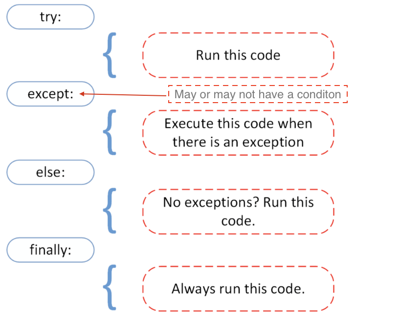

# Introduction

```
print("Hello world")
```

```
print(2 + 3)   # addition(+)
print(3 - 1)   # subtraction(-)
print(2 * 3)   # multiplication(*)
print(3 + 2)   # addition(+)
print(3 - 2)   # subtraction(-)
print(3 * 2)   # multiplication(*)
print(3 / 2)   # division(/)
print(3 ** 2)  # exponential(**)
print(3 % 2)   # modulus(%)
print(3 // 2)  # Floor division operator(//)
```

```
print(type(10))                  # Int
print(type(3.14))                # Float
print(type(1 + 3j))              # Complex
print(type('Asabeneh'))          # String
print(type([1, 2, 3]))           # List
print(type({'name': 'Asabeneh'}))  # Dictionary
print(type({9.8, 3.14, 2.7}))    # Set
print(type((1,2,3)))             #tuple
```


> [!NOTE] 
> Python build-in functions will be done after the functions.


---
## Variables
Variables store data in a computer memory. Mnemonic variables are recommended to use in many programming languages. A mnemonic variable is a variable name that can be easily remembered and associated. A variable refers to a memory address in which data is stored. Number at the beginning, special character, hyphen are not allowed when naming a variable. A variable can have a short name (like x, y, z), but a more descriptive name (firstname, lastname, age, country) is highly recommended.

Python Variable Name Rules

- A variable name must start with a letter or the underscore character
- A variable name cannot start with a number
- A variable name can only contain alpha-numeric characters and underscores (A-z, 0-9, and _ )
- Variable names are case-sensitive (firstname, Firstname, FirstName and FIRSTNAME) are different variables)
-> If you want to use reserved keywords as the variable then use a underscore before them. Eg- "_if"

Example List of Valid variables
```
firstname
lastname
age
country
city
first_name
last_name
capital_city
_if # if we want to use reserved word as a variable
year_2021
year2021
current_year_2021
birth_year
num1
num2
```

Example list of invalid variables
```
first-name
first@name
first$name
num-1
1num
```


### Declaring Multiple Variable in a Line

Multiple variables can also be declared in one line:
```
first_name, last_name, country, age, is_married = 'Asabeneh', 'Yetayeh', 'Helsink', 250, True

print(first_name, last_name, country, age, is_married)
print('First name:', first_name)
print('Last name: ', last_name)
print('Country: ', country)
print('Age: ', age)
print('Married: ', is_married)
```


---
## Data Types
There are several data types in Python. To identify the data type we use the _type_ built-in function.
```
# Different python data types
# Let's declare variables with various data types

first_name = 'Asabeneh'     # str
last_name = 'Yetayeh'       # str
country = 'Finland'         # str
city= 'Helsinki'            # str
age = 250                   # int, it is not my real age, don't worry about it

# Printing out types
print(type('Asabeneh'))          # str
print(type(first_name))          # str
print(type(10))                  # int
print(type(3.14))                # float
print(type(1 + 1j))              # complex
print(type(True))                # bool
print(type([1, 2, 3, 4]))        # list
print(type({'name':'Asabeneh'})) # dict
print(type((1,2)))               # tuple
print(type(zip([1,2],[3,4])))    # zip
print(type({1,2,3}))             # set
```

- zip - In Python, there is no native "zip data type." Instead, zip is a built-in constructor function that returns a specialized iterator called a zip object. This zip object maps corresponding elements from multiple iterables (like lists, tuples, or strings) into an iterator of grouped tuples.
```
>>> names = ["sid","panth","ani"]
>>> age = ["22","17","21"]
>>> zipped_data = zip(names,age)
>>> print(zipped_data)
<zip object at 0x7f730c059cc0>
>>> print(list(zipped_data))
[('sid', '22'), ('panth', '17'), ('ani', '21')]
>>> 
```


---
## Numbers in python
Number data types in Python:

1. Integers: Integer(negative, zero and positive) numbers Example: ... -3, -2, -1, 0, 1, 2, 3 ...
    
2. Floating Point Numbers(Decimal numbers) Example: ... -3.5, -2.25, -1.0, 0.0, 1.1, 2.2, 3.5 ...
    
3. Complex Numbers Example: 1 + j, 2 + 4j, 1 - 1j

---
## Operators
A boolean data type represents one of the two values: _True_ or _False_.
```
>>> if(2==1):
...   print(True)
... else:
...   print(False)
... 
False
>>> 
```

1. Assignment Operators


2. Arithmetic Operators
- Addition(+): a + b
- Subtraction(-): a - b
- Multiplication(*): a * b
- Division(/): a / b
- Modulus(%): a % b
- Floor division(//): a // b
- Exponentiation(**): a ** b

3. Comparison Operators


4. Logical Operators


---
## Strings
Text is a string data type. Any data type written as text is a string. Any data under single, double or triple quote are strings. There are different string methods and built-in functions to deal with string data types. To check the length of a string use the len() method.

- Creating a string
```
letter = 'P'                # A string could be a single character or a bunch of texts
print(letter)               # P
print(len(letter))          # 1
greeting = 'Hello, World!'  # String could be made using a single or double quote,"Hello, World!"
print(greeting)             # Hello, World!
print(len(greeting))        # 13
sentence = "I hope you are enjoying 30 days of Python Challenge"
print(sentence)

multiline_string = '''I am a teacher and enjoy teaching.
I didn't find anything as rewarding as empowering people.
That is why I created 30 days of python.'''
print(multiline_string)

# Another way of doing the same thing
multiline_string = """I am a teacher and enjoy teaching.
I didn't find anything as rewarding as empowering people.
That is why I created 30 days of python."""
print(multiline_string)
```

- String Concatenation
```
first_name = 'Amitabh'
last_name = 'Bacchan'
space = ' '
full_name = first_name  +  space + last_name
print(full_name) # Amitabh Bacchan
# Checking the length of a string using len() built-in function
print(len(first_name))  # 8
print(len(last_name))   # 7
print(len(first_name) > len(last_name)) # True
print(len(full_name)) # 16
```

- Escape Sequences in Strings
In Python and other programming languages \ followed by a character is an escape sequence. Let us see the most common escape characters:

- \n: new line
- \t: Tab means(8 spaces)
- \\: Back slash
- \\': Single quote (')
- \\": Double quote (")

- String Formatting
1. Old Style String Formatting (% Operator)
  %s - String (or any object with a string representation, like numbers)
  %d - Integers
  %f - Floating point numbers
  "%.number of digitsf" - Floating point numbers with fixed precision.
```
# Strings only
first_name = 'Asabeneh'
last_name = 'Yetayeh'
language = 'Python'
formated_string = 'I am %s %s. I teach %s' %(first_name, last_name, language)
print(formated_string)

# Strings  and numbers
radius = 10
pi = 3.14
area = pi * radius ** 2
formated_string = 'The area of circle with a radius %d is %.2f.' %(radius, area) # 2 refers the 2 significant digits after the point

python_libraries = ['Django', 'Flask', 'NumPy', 'Matplotlib','Pandas']
formated_string = 'The following are python libraries:%s' % (python_libraries)
print(formated_string) # "The following are python libraries:['Django', 'Flask', 'NumPy', 'Matplotlib','Pandas']"
```

2. New Style String Formatting (str.format)
    This format was introduced in Python version 3.
```  
first_name = 'Asabeneh'
last_name = 'Yetayeh'
language = 'Python'
formated_string = 'I am {} {}. I teach {}'.format(first_name, last_name, language)
print(formated_string)
a = 4
b = 3

print('{} + {} = {}'.format(a, b, a + b))
print('{} - {} = {}'.format(a, b, a - b))
print('{} * {} = {}'.format(a, b, a * b))
print('{} / {} = {:.2f}'.format(a, b, a / b)) # limits it to two digits after decimal
print('{} % {} = {}'.format(a, b, a % b))
print('{} // {} = {}'.format(a, b, a // b))
print('{} ** {} = {}'.format(a, b, a ** b))

# output
4 + 3 = 7
4 - 3 = 1
4 * 3 = 12
4 / 3 = 1.33
4 % 3 = 1
4 // 3 = 1
4 ** 3 = 64

# Strings  and numbers
radius = 10
pi = 3.14
area = pi * radius ** 2
formated_string = 'The area of a circle with a radius {} is {:.2f}.'.format(radius, area) # 2 digits after decimal
print(formated_string)
```

3. String Interpolation / f-Strings (Python 3.6+)
   Another new string formatting is string interpolation, f-strings. Strings start with f and we can inject the data in their corresponding positions.
```
a = 4
b = 3
print(f'{a} + {b} = {a +b}')
print(f'{a} - {b} = {a - b}')
print(f'{a} * {b} = {a * b}')
print(f'{a} / {b} = {a / b:.2f}')
print(f'{a} % {b} = {a % b}')
print(f'{a} // {b} = {a // b}')
print(f'{a} ** {b} = {a ** b}')
```

### Python Strings as Sequences of Characters

Python strings are sequences of characters, and share their basic methods of access with other Python ordered sequences of objects – lists and tuples. The simplest way of extracting single characters from strings (and individual members from any sequence) is to unpack them into corresponding variables.
```
language = 'Python'
a,b,c,d,e,f = language # unpacking sequence characters into variables
print(a) # P
print(b) # y
print(c) # t
print(d) # h
print(e) # o
print(f) # n
```


```
language = 'Python'
first_letter = language[0]
print(first_letter) # P
second_letter = language[1]
print(second_letter) # y
last_index = len(language) - 1
last_letter = language[last_index]
print(last_letter) # n
language = 'Python'
last_letter = language[-1]
print(last_letter) # n
second_last = language[-2]
print(second_last) # o
```

- Slicing Python Strings
```
language = 'Python'
first_three = language[0:3] # starts at zero index and up to 3 but not include 3
print(first_three) #Pyt
last_three = language[3:6]
print(last_three) # hon
# Another way
last_three = language[-3:]
print(last_three)   # hon
last_three = language[3:]
print(last_three)   # hon
```

- Reversing a string
```
greeting = 'Hello, World!'
print(greeting[::-1]) # !dlroW ,olleH
```

- Skipping Characters While Slicing
```
language = 'Python'
pto = language[0:6:2] #[starting index,ending index,steps]
print(pto) # Pto
```

### String Methods
- capitalize(): Converts the first character of the string to capital letter.
```
challenge = 'python is a mastikhor language'
print(challenge.capitalize()) # 'Python is a mastikhor language'
```

- count(): returns occurrences of substring in string, count(substring, start=.., end=..). The start is a starting indexing for counting and end is the last index to count.
```
challenge = 'thirty days of python'
print(challenge.count('y')) # 3
print(challenge.count('y', 7, 14)) # 1, 
print(challenge.count('th')) # 2
```

- endswith(): Checks if a string ends with a specified ending.
```
challenge = 'thirty days of python'
print(challenge.endswith('on'))   # True
print(challenge.endswith('tion')) # False
```

- expandtabs(): Replaces tab character with spaces, default tab size is 8. It takes tab size argument.
```
challenge = 'thirty\tdays\tof\tpython'
print(challenge.expandtabs())   # 'thirty  days    of      python'
print(challenge.expandtabs(10)) # 'thirty    days      of        python'
```

- find(): Returns the index of the first occurrence of a substring, if not found returns -1.
```
challenge = 'thirty days of python'
print(challenge.find('y'))  # 5
print(challenge.find('th')) # 0
```

- rfind(): Returns the index of the last occurrence of a substring, if not found returns -1.
```
challenge = 'thirty days of python'
print(challenge.rfind('y'))  # 16
print(challenge.rfind('th')) # 17
```

- index(): Returns the lowest index of a substring, additional arguments indicate starting and ending index (default 0 and string length - 1). If the substring is not found it raises a valueError.
```
challenge = 'thirty days of python'
sub_string = 'da'
print(challenge.index(sub_string))  # 7
print(challenge.index(sub_string, 9)) # error
```

- rindex(): Returns the highest index of a substring, additional arguments indicate starting and ending index (default 0 and string length - 1)
```
challenge = 'thirty days of python'
sub_string = 'da'
print(challenge.rindex(sub_string))  # 7
print(challenge.rindex(sub_string, 9)) # error
print(challenge.rindex('on', 8)) # 19
```

- isalnum(): Checks alphanumeric character
```py
challenge = 'ThirtyDaysPython'
print(challenge.isalnum()) # True

challenge = '30DaysPython'
print(challenge.isalnum()) # True

challenge = 'thirty days of python'
print(challenge.isalnum()) # False, space is not an alphanumeric character

challenge = 'thirty days of python 2019'
print(challenge.isalnum()) # False
```

- isalpha(): Checks if all string elements are alphabet characters (a-z and A-Z)
```py
challenge = 'thirty days of python'
print(challenge.isalpha()) # False, space is once again excluded
challenge = 'ThirtyDaysPython'
print(challenge.isalpha()) # True
num = '123'
print(num.isalpha())      # False
```

- isdecimal(): Checks if all characters in a string are decimal (0-9)
```py
challenge = 'thirty days of python'
print(challenge.isdecimal())  # False
challenge = '123'
print(challenge.isdecimal())  # True
challenge = '\u00B2'
print(challenge.isdigit())   # True 
challenge = '12 3'
print(challenge.isdecimal())  # False, space not allowed
```

- isdigit(): Checks if all characters in a string are numbers (0-9 and some other unicode characters for numbers)
```py
challenge = 'Thirty'
print(challenge.isdigit()) # False
challenge = '30'
print(challenge.isdigit())   # True
challenge = '\u00B2'
print(challenge.isdigit())   # True
```

- isnumeric(): Checks if all characters in a string are numbers or number related (just like isdigit(), just accepts more symbols, like ½)
```py
num = '10'
print(num.isnumeric()) # True
num = '\u00BD' # ½
print(num.isnumeric()) # True
num = '10.5'
print(num.isnumeric()) # False
```

- isidentifier(): Checks for a valid identifier - it checks if a string is a valid variable name
```py
challenge = '30DaysOfPython'
print(challenge.isidentifier()) # False, because it starts with a number
challenge = 'thirty_days_of_python'
print(challenge.isidentifier()) # True
```

- islower(): Checks if all alphabet characters in the string are lowercase
```py
challenge = 'thirty days of python'
print(challenge.islower()) # True
challenge = 'Thirty days of python'
print(challenge.islower()) # False
```

- isupper(): Checks if all alphabet characters in the string are uppercase
```py
challenge = 'thirty days of python'
print(challenge.isupper()) #  False
challenge = 'THIRTY DAYS OF PYTHON'
print(challenge.isupper()) # True
```

- join(): Returns a concatenated string
```py
web_tech = ['HTML', 'CSS', 'JavaScript', 'React']
result = ' '.join(web_tech)
print(result) # 'HTML CSS JavaScript React'
```

```py
web_tech = ['HTML', 'CSS', 'JavaScript', 'React']
result = '# '.join(web_tech)
print(result) # 'HTML# CSS# JavaScript# React'
```

- strip(): Removes all given characters starting from the beginning and end of the string
```py
challenge = 'thirty days of pythoonnn'
print(challenge.strip('noth')) # 'irty days of py'
```

- replace(): Replaces substring with a given string
```py
challenge = 'thirty days of python'
print(challenge.replace('python', 'coding')) # 'thirty days of coding'
```

- split(): Splits the string, using given string or space as a separator
```py
challenge = 'thirty days of python'
print(challenge.split()) # ['thirty', 'days', 'of', 'python']
challenge = 'thirty, days, of, python'
print(challenge.split(', ')) # ['thirty', 'days', 'of', 'python']
```

- title(): Returns a title cased string
```py
challenge = 'thirty days of python'
print(challenge.title()) # Thirty Days Of Python
```

- swapcase(): Converts all uppercase characters to lowercase and all lowercase characters to uppercase characters
```py
challenge = 'thirty days of python'
print(challenge.swapcase())   # THIRTY DAYS OF PYTHON
challenge = 'Thirty Days Of Python'
print(challenge.swapcase())  # tHIRTY dAYS oF pYTHON
```

- startswith(): Checks if String Starts with the Specified String
```py
challenge = 'thirty days of python'
print(challenge.startswith('thirty')) # True

challenge = '30 days of python'
print(challenge.startswith('thirty')) # False
```


---
## Lists
List: is a collection which is ordered and changeable(modifiable). Allows duplicate members.
A list is collection of different data types which is ordered and modifiable(mutable). A list can be empty or it may have different data type items.
- Creating a list
  - A list can be created in two manners
   -> Using the build-in function list()
   -> Using the `[]` square brackets
```
# syntax
lst = list()

empty_list = list() # this is an empty list, no item in the list
print(len(empty_list)) # 0

# syntax
lst = []

empty_list = [] # this is an empty list, no item in the list
print(len(empty_list)) # 0
```

```
fruits = ['banana', 'orange', 'mango', 'lemon']                     # list of fruits
vegetables = ['Tomato', 'Potato', 'Cabbage','Onion', 'Carrot']      # list of vegetables
animal_products = ['milk', 'meat', 'butter', 'yoghurt']             # list of animal products
web_techs = ['HTML', 'CSS', 'JS', 'React','Redux', 'Node', 'MongDB'] # list of web technologies
countries = ['Finland', 'Estonia', 'Denmark', 'Sweden', 'Norway'] 

# Print the lists and its length
print('Fruits:', fruits)
print('Number of fruits:', len(fruits))
print('Vegetables:', vegetables)
print('Number of vegetables:', len(vegetables))
print('Animal products:',animal_products)
print('Number of animal products:', len(animal_products))
print('Web technologies:', web_techs)
print('Number of web technologies:', len(web_techs))
print('Countries:', countries)
print('Number of countries:', len(countries))
```

Outputs:
```
output
Fruits: ['banana', 'orange', 'mango', 'lemon']
Number of fruits: 4
Vegetables: ['Tomato', 'Potato', 'Cabbage', 'Onion', 'Carrot']
Number of vegetables: 5
Animal products: ['milk', 'meat', 'butter', 'yoghurt']
Number of animal products: 4
Web technologies: ['HTML', 'CSS', 'JS', 'React', 'Redux', 'Node', 'MongDB']
Number of web technologies: 7
Countries: ['Finland', 'Estonia', 'Denmark', 'Sweden', 'Norway']
Number of countries: 5
```

- A list can have more than one datatype
```
 lst = ['Asabeneh', 250, True, {'country':'Finland', 'city':'Helsinki'}] # list containing different data types
```

- Indexing in list


- Unpacking list items
```
lst = ['item1','item2','item3', 'item4', 'item5']
first_item, second_item, third_item, *rest = lst
print(first_item)     # item1
print(second_item)    # item2
print(third_item)     # item3
print(rest)           # ['item4', 'item5']

# First Example
fruits = ['banana', 'orange', 'mango', 'lemon','lime','apple']
first_fruit, second_fruit, third_fruit, *rest = fruits 
print(first_fruit)     # banana
print(second_fruit)    # orange
print(third_fruit)     # mango
print(rest)           # ['lemon','lime','apple']
# Second Example about unpacking list
first, second, third,*rest, tenth = [1,2,3,4,5,6,7,8,9,10]
print(first)          # 1
print(second)         # 2
print(third)          # 3
print(rest)           # [4,5,6,7,8,9]
print(tenth)          # 10
# Third Example about unpacking list
countries = ['Germany', 'France','Belgium','Sweden','Denmark','Finland','Norway','Iceland','Estonia']
gr, fr, bg, sw, *scandic, es = countries
print(gr) 
print(fr)
print(bg)
print(sw)
print(scandic)
print(es)
```

- Slicing Items from a List
  Positive Indexing: We can specify a range of positive indexes by specifying the start, end and step, the return value will be a new list. (default values for start = 0, end = len(lst) - 1 (last item), step = 1)
```py
fruits = ['banana', 'orange', 'mango', 'lemon']
all_fruits = fruits[0:4] # it returns all the fruits
# this will also give the same result as the one above
all_fruits = fruits[0:] # if we don't set where to stop it takes all the rest
orange_and_mango = fruits[1:3] # it does not include the first index
orange_mango_lemon = fruits[1:]
orange_and_lemon = fruits[::2] # here we used a 3rd argument, step. It will take every 2cnd item - ['banana', 'mango']
```

   Negative Indexing: We can specify a range of negative indexes by specifying the start, end and step, the return value will be a new list.
```py
fruits = ['banana', 'orange', 'mango', 'lemon']
all_fruits = fruits[-4:] # it returns all the fruits
orange_and_mango = fruits[-3:-1] # it does not include the last index,['orange', 'mango']
orange_mango_lemon = fruits[-3:] # this will give starting from -3 to the end,['orange', 'mango', 'lemon']
reverse_fruits = fruits[::-1] # a negative step will take the list in reverse order,['lemon', 'mango', 'orange', 'banana']
```

- Modifying Lists
  List is a mutable or modifiable ordered collection of items. Lets modify the fruit list.
```py
fruits = ['banana', 'orange', 'mango', 'lemon']
fruits[0] = 'avocado'
print(fruits)       #  ['avocado', 'orange', 'mango', 'lemon']
fruits[1] = 'apple'
print(fruits)       #  ['avocado', 'apple', 'mango', 'lemon']
last_index = len(fruits) - 1
fruits[last_index] = 'lime'
print(fruits)        #  ['avocado', 'apple', 'mango', 'lime']
```

- Checking Items in a List
  Checking an item if it is a member of a list using *in* operator. See the example below.
```py
fruits = ['banana', 'orange', 'mango', 'lemon']
does_exist = 'banana' in fruits
print(does_exist)  # True
does_exist = 'lime' in fruits
print(does_exist)  # False
```

 - Adding Items to a List
   To add item to the end of an existing list we use the method *append()*.
```py
# syntax
lst = list()
lst.append(item)
```

```py
fruits = ['banana', 'orange', 'mango', 'lemon']
fruits.append('apple')
print(fruits)           # ['banana', 'orange', 'mango', 'lemon', 'apple']
fruits.append('lime')   # ['banana', 'orange', 'mango', 'lemon', 'apple', 'lime']
print(fruits)
```

-  Inserting Items into a List
   We can use *insert()* method to insert a single item at a specified index in a list. Note that other items are shifted to the right. The *insert()* methods takes two arguments:index and an item to insert.

```py
# syntax
lst = ['item1', 'item2']
lst.insert(index, item)
```

```py
fruits = ['banana', 'orange', 'mango', 'lemon']
fruits.insert(2, 'apple') # insert apple between orange and mango
print(fruits)           # ['banana', 'orange', 'apple', 'mango', 'lemon']
fruits.insert(3, 'lime')   # ['banana', 'orange', 'apple', 'lime', 'mango', 'lemon']
print(fruits)
```

- Removing Items from a List
  The remove method removes a specified item from a list
```py
# syntax
lst = ['item1', 'item2']
lst.remove(item)
```

```py
fruits = ['banana', 'orange', 'mango', 'lemon', 'banana']
fruits.remove('banana')
print(fruits)  # ['orange', 'mango', 'lemon', 'banana'] - this method removes the first occurrence of the item in the list
fruits.remove('lemon')
print(fruits)  # ['orange', 'mango', 'banana']
```

-  Removing Items Using Pop
   The *pop()* method removes the specified index, (or the last item if index is not specified):
```py
# syntax
lst = ['item1', 'item2']
lst.pop()       # last item
lst.pop(index)
```

```py
fruits = ['banana', 'orange', 'mango', 'lemon']
fruits.pop()
print(fruits)       # ['banana', 'orange', 'mango']

fruits.pop(0)
print(fruits)       # ['orange', 'mango']
```

- Removing Items Using Del
  The *del* keyword removes the specified index and it can also be used to delete items within index range. It can also delete the list completely
```py
# syntax
lst = ['item1', 'item2']
del lst[index] # only a single item
del lst        # to delete the list completely
```
```py
fruits = ['banana', 'orange', 'mango', 'lemon', 'kiwi', 'lime']
del fruits[0]
print(fruits)       # ['orange', 'mango', 'lemon', 'kiwi', 'lime']
del fruits[1]
print(fruits)       # ['orange', 'lemon', 'kiwi', 'lime']
del fruits[1:3]     # this deletes items between given indexes, so it does not delete the item with index 3!
print(fruits)       # ['orange', 'lime']
del fruits
print(fruits)       # This should give: NameError: name 'fruits' is not defined
```

- Clearing List Items
  The *clear()* method empties the list:
```py
# syntax
lst = ['item1', 'item2']
lst.clear()
```

```py
fruits = ['banana', 'orange', 'mango', 'lemon']
fruits.clear()
print(fruits)       # []
```

-  Copying a List
   It is possible to copy a list by reassigning it to a new variable in the following way: list2 = list1. Now, list2 is a reference of list1, any changes we make in list2 will also modify the original, list1. But there are lots of case in which we do not like to modify the original instead we like to have a different copy. One of way of avoiding the problem above is using _copy()_.
```py
# syntax
lst = ['item1', 'item2']
lst_copy = lst.copy()
```

```py
fruits = ['banana', 'orange', 'mango', 'lemon']
fruits_copy = fruits.copy()
print(fruits_copy)       # ['banana', 'orange', 'mango', 'lemon']
```

- Joining Lists
  There are several ways to join, or concatenate, two or more lists in Python.
-> Plus Operator (+)
```py
# syntax
list3 = list1 + list2
```

```py
positive_numbers = [1, 2, 3, 4, 5]
zero = [0]
negative_numbers = [-5,-4,-3,-2,-1]
integers = negative_numbers + zero + positive_numbers
print(integers) # [-5, -4, -3, -2, -1, 0, 1, 2, 3, 4, 5]
fruits = ['banana', 'orange', 'mango', 'lemon']
vegetables = ['Tomato', 'Potato', 'Cabbage', 'Onion', 'Carrot']
fruits_and_vegetables = fruits + vegetables
print(fruits_and_vegetables ) # ['banana', 'orange', 'mango', 'lemon', 'Tomato', 'Potato', 'Cabbage', 'Onion', 'Carrot']
```

-> Joining using extend() method
  The *extend()* method allows to append list in a list. See the example below.
```py
# syntax
list1 = ['item1', 'item2']
list2 = ['item3', 'item4', 'item5']
list1.extend(list2) # ['item1', 'item2', 'item3', 'item4', 'item5']
```

```py
num1 = [0, 1, 2, 3]
num2= [4, 5, 6]
num1.extend(num2)
print('Numbers:', num1) # Numbers: [0, 1, 2, 3, 4, 5, 6]
negative_numbers = [-5,-4,-3,-2,-1]
positive_numbers = [1, 2, 3,4,5]
zero = [0]
negative_numbers.extend(zero)
negative_numbers.extend(positive_numbers)
print('Integers:', negative_numbers) # Integers: [-5, -4, -3, -2, -1, 0, 1, 2, 3, 4, 5]
fruits = ['banana', 'orange', 'mango', 'lemon']
vegetables = ['Tomato', 'Potato', 'Cabbage', 'Onion', 'Carrot']
fruits.extend(vegetables)
print('Fruits and vegetables:', fruits ) # Fruits and vegetables: ['banana', 'orange', 'mango', 'lemon', 'Tomato', 'Potato', 'Cabbage', 'Onion', 'Carrot']
```

- Counting Items in a List
  The *count()* method returns the number of times an item appears in a list:
```py
# syntax
lst = ['item1', 'item2']
lst.count(item)
```

```py
fruits = ['banana', 'orange', 'mango', 'lemon']
print(fruits.count('orange'))   # 1
ages = [22, 19, 24, 25, 26, 24, 25, 24]
print(ages.count(24))           # 3
```

-  Finding Index of an Item
   The *index()* method returns the index of an item in the list:
```py
# syntax
lst = ['item1', 'item2']
lst.index(item)
```

```py
fruits = ['banana', 'orange', 'mango', 'lemon']
print(fruits.index('orange'))   # 1
ages = [22, 19, 24, 25, 26, 24, 25, 24]
print(ages.index(24))           # 2, the first occurrence
```

- Reversing a List
  The *reverse()* method reverses the order of a list.
```py
# syntax
lst = ['item1', 'item2']
lst.reverse()
```

```py
fruits = ['banana', 'orange', 'mango', 'lemon']
fruits.reverse()
print(fruits) # ['lemon', 'mango', 'orange', 'banana']
ages = [22, 19, 24, 25, 26, 24, 25, 24]
ages.reverse()
print(ages) # [24, 25, 24, 26, 25, 24, 19, 22]
```

- Sorting List Items
  To sort lists we can use _sort()_ method or _sorted()_ built-in functions. The _sort()_ method reorders the list items in ascending order and modifies the original list. If an argument of _sort()_ method reverse is equal to true, it will arrange the list in descending order.
-> sort(): this method modifies the original list
  ```py
  # syntax
  lst = ['item1', 'item2']
  lst.sort()                # ascending
  lst.sort(reverse=True)    # descending
  ```
  **Example:**
  ```py
  fruits = ['banana', 'orange', 'mango', 'lemon']
  fruits.sort()
  print(fruits)             # sorted in alphabetical order, ['banana', 'lemon', 'mango', 'orange']
  fruits.sort(reverse=True)
  print(fruits) # ['orange', 'mango', 'lemon', 'banana']
  ages = [22, 19, 24, 25, 26, 24, 25, 24]
  ages.sort()
  print(ages) #  [19, 22, 24, 24, 24, 25, 25, 26]
 
  ages.sort(reverse=True)
  print(ages) #  [26, 25, 25, 24, 24, 24, 22, 19]
  ```
  sorted(): returns the ordered list without modifying the original list
  **Example:**
  ```py
  fruits = ['banana', 'orange', 'mango', 'lemon']
  print(sorted(fruits))   # ['banana', 'lemon', 'mango', 'orange']
  # Reverse order
  fruits = ['banana', 'orange', 'mango', 'lemon']
  fruits = sorted(fruits,reverse=True)
  print(fruits)     # ['orange', 'mango', 'lemon', 'banana']
  ```

---
## Tuples

A tuple is a collection of different data types which is ordered and unchangeable (immutable). Tuples are written with round brackets, (). Once a tuple is created, we cannot change its values. We cannot use add, insert, remove methods in a tuple because it is not modifiable (mutable). Unlike list, tuple has few methods. Methods related to tuples:

- tuple(): to create an empty tuple
- count(): to count the number of a specified item in a tuple
- index(): to find the index of a specified item in a tuple
- `+` operator: to join two or more tuples and to create a new tuple

#### Creating a Tuple
- Empty tuple: Creating an empty tuple
  
  ```py
  # syntax
  empty_tuple = ()
  # or using the tuple constructor
  empty_tuple = tuple()
  ```

- Tuple with initial values
  
  ```py
  # syntax
  tpl = ('item1', 'item2','item3')
  ```

  ```py
  fruits = ('banana', 'orange', 'mango', 'lemon')
  ```

#### Tuple length
We use the _len()_ method to get the length of a tuple.

```py
# syntax
tpl = ('item1', 'item2', 'item3')
len(tpl)
```

#### Accessing Tuple Items
- Positive Indexing
  Similar to the list data type we use positive or negative indexing to access tuple items.

  ```py
  # Syntax
  tpl = ('item1', 'item2', 'item3')
  first_item = tpl[0]
  second_item = tpl[1]
  ```

  ```py
  fruits = ('banana', 'orange', 'mango', 'lemon')
  first_fruit = fruits[0]
  second_fruit = fruits[1]
  last_index =len(fruits) - 1
  last_fruit = fruits[last_index]
  ```

- Negative indexing
  Negative indexing means beginning from the end, -1 refers to the last item, -2 refers to the second last and the negative of the list/tuple length refers to the first item.

  ```py
  # Syntax
  tpl = ('item1', 'item2', 'item3','item4')
  first_item = tpl[-4]
  second_item = tpl[-3]
  ```

  ```py
  fruits = ('banana', 'orange', 'mango', 'lemon')
  first_fruit = fruits[-4]
  second_fruit = fruits[-3]
  last_fruit = fruits[-1]
  ```

#### Slicing tuples
We can slice out a sub-tuple by specifying a range of indexes where to start and where to end in the tuple, the return value will be a new tuple with the specified items.

- Range of Positive Indexes

  ```py
  # Syntax
  tpl = ('item1', 'item2', 'item3','item4')
  all_items = tpl[0:4]         # all items
  all_items = tpl[0:]         # all items
  middle_two_items = tpl[1:3]  # does not include item at index 3
  ```

  ```py
  fruits = ('banana', 'orange', 'mango', 'lemon')
  all_fruits = fruits[0:4]    # all items
  all_fruits= fruits[0:]      # all items
  orange_mango = fruits[1:3]  # doesn't include item at index 3
  orange_to_the_rest = fruits[1:]
  ```

- Range of Negative Indexes

  ```py
  # Syntax
  tpl = ('item1', 'item2', 'item3','item4')
  all_items = tpl[-4:]         # all items
  middle_two_items = tpl[-3:-1]  # does not include item at index 3 (-1)
  ```

  ```py
  fruits = ('banana', 'orange', 'mango', 'lemon')
  all_fruits = fruits[-4:]    # all items
  orange_mango = fruits[-3:-1]  # doesn't include item at index 3
  orange_to_the_rest = fruits[-3:]
  ```

#### Changing Tuples to Lists
We can change tuples to lists and lists to tuples. Tuple is immutable if we want to modify a tuple we should change it to a list.

```py
# Syntax
tpl = ('item1', 'item2', 'item3','item4')
lst = list(tpl)
```

```py
fruits = ('banana', 'orange', 'mango', 'lemon')
fruits = list(fruits)
fruits[0] = 'apple'
print(fruits)     # ['apple', 'orange', 'mango', 'lemon']
fruits = tuple(fruits)
print(fruits)     # ('apple', 'orange', 'mango', 'lemon')
```

#### Checking an Item in a Tuple
We can check if an item exists or not in a tuple using _in_, it returns a boolean.

```py
# Syntax
tpl = ('item1', 'item2', 'item3','item4')
'item2' in tpl # True
```

```py
fruits = ('banana', 'orange', 'mango', 'lemon')
print('orange' in fruits) # True
print('apple' in fruits) # False
fruits[0] = 'apple' # TypeError: 'tuple' object does not support item assignment
```

#### Joining Tuples
We can join two or more tuples using + operator

```py
# syntax
tpl1 = ('item1', 'item2', 'item3')
tpl2 = ('item4', 'item5','item6')
tpl3 = tpl1 + tpl2
```

```py
fruits = ('banana', 'orange', 'mango', 'lemon')
vegetables = ('Tomato', 'Potato', 'Cabbage','Onion', 'Carrot')
fruits_and_vegetables = fruits + vegetables
```

#### Deleting Tuples
It is not possible to remove a single item in a tuple but it is possible to delete the tuple itself using _del_.

```py
# syntax
tpl1 = ('item1', 'item2', 'item3')
del tpl1

```

```py
fruits = ('banana', 'orange', 'mango', 'lemon')
del fruits
```

---
## Sets
Set is a collection of items. Let me take you back to your elementary or high school Mathematics lesson. The Mathematics definition of a set can be applied also in Python. Set is a collection of unordered and un-indexed distinct elements. In Python set is used to store unique items, and it is possible to find the _union_, _intersection_, _difference_, _symmetric difference_, _subset_, _super set_ and _disjoint set_ among sets.

#### Creating a Set
To create an empty set, we use the set() function. Empty curly brackets {} will create a dictionary. 

- Creating an empty set
```py
# syntax
st = set()
```
- Creating a set with initial items
```py
# syntax
st = {'item1', 'item2', 'item3', 'item4'}
```
**Example:**
```py
# syntax
fruits = {'banana', 'orange', 'mango', 'lemon'}
```

#### Getting Set's Length
We use **len()** method to find the length of a set.
```py
# syntax
st = {'item1', 'item2', 'item3', 'item4'}
len(st)
```
**Example:**
```py
fruits = {'banana', 'orange', 'mango', 'lemon'}
len(fruits)
```

#### Accessing Items in a Set
We use loops to access items. We will see this in loop section
#### Checking an Item
To check if an item exist in a list we use _in_ membership operator.
```py
# syntax
st = {'item1', 'item2', 'item3', 'item4'}
print("Does set st contain item3? ", 'item3' in st) # Does set st contain item3? True
```
**Example:**
```py
fruits = {'banana', 'orange', 'mango', 'lemon'}
print('mango' in fruits ) # True
```

#### Adding Items to a Set
Once a set is created we cannot change any items and we can also add additional items.
- Add one item using _add()_
```py
# syntax
st = {'item1', 'item2', 'item3', 'item4'}
st.add('item5')
```
**Example:**
```py
fruits = {'banana', 'orange', 'mango', 'lemon'}
fruits.add('lime')
```
- Add multiple items using _update()_
  The _update()_ allows to add multiple items to a set. The _update()_ takes a list argument.
```py
# syntax
st = {'item1', 'item2', 'item3', 'item4'}
st.update(['item5','item6','item7'])
```
**Example:**
```py
fruits = {'banana', 'orange', 'mango', 'lemon'}
vegetables = ('tomato', 'potato', 'cabbage','onion', 'carrot')
fruits.update(vegetables)
```

#### Removing Items from a Set
We can remove an item from a set using _remove()_ method. If the item is not found _remove()_ method will raise errors, so it is good to check if the item exist in the given set. However, _discard()_ method doesn't raise any errors.
```py
# syntax
st = {'item1', 'item2', 'item3', 'item4'}
st.remove('item2')
```
The pop() methods remove a random item from a list and it returns the removed item.
**Example:**
```py
fruits = {'banana', 'orange', 'mango', 'lemon'}
fruits.pop()  # removes a random item from the set

```
If we are interested in the removed item.
```py
fruits = {'banana', 'orange', 'mango', 'lemon'}
removed_item = fruits.pop() 
```

#### Clearing Items in a Set
If we want to clear or empty the set we use _clear_ method.
```py
# syntax
st = {'item1', 'item2', 'item3', 'item4'}
st.clear()
```
**Example:**
```py
fruits = {'banana', 'orange', 'mango', 'lemon'}
fruits.clear()
print(fruits) # set()
```

#### Deleting a Set
If we want to delete the set itself we use _del_ operator.
```py
# syntax
st = {'item1', 'item2', 'item3', 'item4'}
del st
```
**Example:**
```py
fruits = {'banana', 'orange', 'mango', 'lemon'}
del fruits
```

#### Converting List to Set
We can convert list to set and set to list. Converting list to set removes duplicates and only unique items will be reserved.
```py
# syntax
lst = ['item1', 'item2', 'item3', 'item4', 'item1']
st = set(lst)  # {'item2', 'item4', 'item1', 'item3'} - the order is random, because sets in general are unordered
```
**Example:**
```py
fruits = ['banana', 'orange', 'mango', 'lemon','orange', 'banana']
fruits = set(fruits) # {'mango', 'lemon', 'banana', 'orange'}
```

#### Joining Sets
We can join two sets using the _union()_ or _update()_ method or _|_ symbol .
- Union
  This method returns a new set
```py
# syntax
st1 = {'item1', 'item2', 'item3', 'item4'}
st2 = {'item5', 'item6', 'item7', 'item8'}
st3 = st1.union(st2) #st3 = st1 | st2
```
**Example:**
```py
fruits = {'banana', 'orange', 'mango', 'lemon'}
vegetables = {'tomato', 'potato', 'cabbage','onion', 'carrot'}
print(fruits.union(vegetables)) # {'lemon', 'carrot', 'tomato', 'banana', 'mango', 'orange', 'cabbage', 'potato', 'onion'}
# or using this : print(fruits | vegetables)
```
- Update
  This method inserts a set into a given set
```py
# syntax
st1 = {'item1', 'item2', 'item3', 'item4'}
st2 = {'item5', 'item6', 'item7', 'item8'}
st1.update(st2) # st2 contents are added to st1
```
**Example:**
```py
fruits = {'banana', 'orange', 'mango', 'lemon'}
vegetables = {'tomato', 'potato', 'cabbage','onion', 'carrot'}
fruits.update(vegetables)
print(fruits) # {'lemon', 'carrot', 'tomato', 'banana', 'mango', 'orange', 'cabbage', 'potato', 'onion'}
```

#### Finding Intersection Items
Intersection returns a set of items which are in both the sets or using _&_ symbol. See the example
```py
# syntax
st1 = {'item1', 'item2', 'item3', 'item4'}
st2 = {'item3', 'item2'}
st1.intersection(st2) # {'item3', 'item2'}
# or using thia : st1 & st2
```
**Example:**
```py
whole_numbers = {0, 1, 2, 3, 4, 5, 6, 7, 8, 9, 10}
even_numbers = {0, 2, 4, 6, 8, 10}
whole_numbers.intersection(even_numbers) # {0, 2, 4, 6, 8, 10}

python = {'p', 'y', 't', 'h', 'o','n'}
dragon = {'d', 'r', 'a', 'g', 'o','n'}
python.intersection(dragon)     # {'o', 'n'}
# python & dragon
```

#### Checking Subset and Super Set
A set can be a subset or super set of other sets:
- Subset: _issubset()_
- Super set: _issuperset_
```py
# syntax
st1 = {'item1', 'item2', 'item3', 'item4'}
st2 = {'item2', 'item3'}
st2.issubset(st1) # True
st1.issuperset(st2) # True
```
**Example:**
```py
whole_numbers = {0, 1, 2, 3, 4, 5, 6, 7, 8, 9, 10}
even_numbers = {0, 2, 4, 6, 8, 10}
whole_numbers.issubset(even_numbers) # False, because it is a super set
whole_numbers.issuperset(even_numbers) # True

python = {'p', 'y', 't', 'h', 'o','n'}
dragon = {'d', 'r', 'a', 'g', 'o','n'}
python.issubset(dragon)     # False
```

#### Checking the Difference Between Two Sets
It returns the difference between two sets or using _-_ symbol .
```py
# syntax
st1 = {'item1', 'item2', 'item3', 'item4'}
st2 = {'item2', 'item3'}
st2.difference(st1) # set() : st2 - st1
st1.difference(st2) # {'item1', 'item4'} => st1\st2  : st2 - st1
```
**Example:**
```py
whole_numbers = {0, 1, 2, 3, 4, 5, 6, 7, 8, 9, 10}
even_numbers = {0, 2, 4, 6, 8, 10}
whole_numbers.difference(even_numbers) # {1, 3, 5, 7, 9}

python = {'p', 'y', 't', 'o','n'}
dragon = {'d', 'r', 'a', 'g', 'o','n'}
python.difference(dragon)     # {'p', 'y', 't'}  - the result is unordered (characteristic of sets)
# python - dragon
dragon.difference(python)     # {'d', 'r', 'a', 'g'}
# dragon - python
```

#### Finding Symmetric Difference Between Two Sets
It returns the symmetric difference between two sets. It means that it returns a set that contains all items from both sets, except items that are present in both sets, mathematically: (A\B) ∪ (B\A)

```py
# syntax
st1 = {'item1', 'item2', 'item3', 'item4'}
st2 = {'item2', 'item3'}
# it means (A\B)∪(B\A)
st2.symmetric_difference(st1) # {'item1', 'item4'} : st2 ^ st1
```
**Example:**
```py
whole_numbers = {0, 1, 2, 3, 4, 5, 6, 7, 8, 9, 10}
some_numbers = {1, 2, 3, 4, 5}
whole_numbers.symmetric_difference(some_numbers) # {0, 6, 7, 8, 9, 10}

python = {'p', 'y', 't', 'h', 'o','n'}
dragon = {'d', 'r', 'a', 'g', 'o','n'}
python.symmetric_difference(dragon)  # {'r', 't', 'p', 'y', 'g', 'a', 'd', 'h'}
# python ^ dragon
```

#### Joining Sets
If two sets do not have a common item or items we call them disjoint sets. We can check if two sets are joint or disjoint using _isdisjoint()_ method.

```py
# syntax
st1 = {'item1', 'item2', 'item3', 'item4'}
st2 = {'item2', 'item3'}
st2.isdisjoint(st1) # False
```

**Example:**

```py
even_numbers = {0, 2, 4 ,6, 8}
odd_numbers = {1, 3, 5, 7, 9}
even_numbers.isdisjoint(odd_numbers) # True, because no common item

python = {'p', 'y', 't', 'h', 'o','n'}
dragon = {'d', 'r', 'a', 'g', 'o','n'}
python.isdisjoint(dragon)  # False, there are common items {'o', 'n'}
```

---
## Dictionaries

A dictionary is a collection of unordered, modifiable(mutable) paired (key: value) data type.

### Creating a Dictionary

To create a dictionary we use curly brackets, {} or the *dict()* built-in function.

```py
# syntax
empty_dict = {}
# Dictionary with data values
dct = {'key1':'value1', 'key2':'value2', 'key3':'value3', 'key4':'value4'}
```

**Example:**

```py
person = {
    'first_name':'Asabeneh',
    'last_name':'Yetayeh',
    'age':250,
    'country':'Finland',
    'is_marred':True,
    'skills':['JavaScript', 'React', 'Node', 'MongoDB', 'Python'],
    'address':{
        'street':'Space street',
        'zipcode':'02210'
    }
    }
```

The dictionary above shows that a value could be any data types:string, boolean, list, tuple, set or a dictionary.

### Dictionary Length

It checks the number of 'key: value' pairs in the dictionary.

```py
# syntax
dct = {'key1':'value1', 'key2':'value2', 'key3':'value3', 'key4':'value4'}
print(len(dct)) # 4
```

**Example:**

```py
person = {
    'first_name':'Asabeneh',
    'last_name':'Yetayeh',
    'age':250,
    'country':'Finland',
    'is_married':True,
    'skills':['JavaScript', 'React', 'Node', 'MongoDB', 'Python'],
    'address':{
        'street':'Space street',
        'zipcode':'02210'
    }
    }
print(len(person)) # 7

```

### Accessing Dictionary Items

We can access Dictionary items by referring to its key name.

```py
# syntax
dct = {'key1':'value1', 'key2':'value2', 'key3':'value3', 'key4':'value4'}
print(dct['key1']) # value1
print(dct['key4']) # value4
```

**Example:**

```py
person = {
    'first_name':'Asabeneh',
    'last_name':'Yetayeh',
    'age':250,
    'country':'Finland',
    'is_marred':True,
    'skills':['JavaScript', 'React', 'Node', 'MongoDB', 'Python'],
    'address':{
        'street':'Space street',
        'zipcode':'02210'
    }
    }
print(person['first_name']) # Asabeneh
print(person['country'])    # Finland
print(person['skills'])     # ['JavaScript', 'React', 'Node', 'MongoDB', 'Python']
print(person['skills'][0])  # JavaScript
print(person['address']['street']) # Space street
print(person['city'])       # Error
```

Accessing an item by key name raises an error if the key does not exist. To avoid this error first we have to check if a key exist or we can use the _get_ method. The get method returns None, which is a NoneType object data type, if the key does not exist.
```py
person = {
    'first_name':'Asabeneh',
    'last_name':'Yetayeh',
    'age':250,
    'country':'Finland',
    'is_marred':True,
    'skills':['JavaScript', 'React', 'Node', 'MongoDB', 'Python'],
    'address':{
        'street':'Space street',
        'zipcode':'02210'
    }
    }
print(person.get('first_name')) # Asabeneh
print(person.get('country'))    # Finland
print(person.get('skills')) #['JavaScript', 'React', 'Node', 'MongoDB', 'Python']
print(person.get('city'))   # None
```

### Adding Items to a Dictionary

We can add new key and value pairs to a dictionary

```py
# syntax
dct = {'key1':'value1', 'key2':'value2', 'key3':'value3', 'key4':'value4'}
dct['key5'] = 'value5'
```

**Example:**

```py
person = {
    'first_name':'Asabeneh',
    'last_name':'Yetayeh',
    'age':250,
    'country':'Finland',
    'is_marred':True,
    'skills':['JavaScript', 'React', 'Node', 'MongoDB', 'Python'],
    'address':{
        'street':'Space street',
        'zipcode':'02210'
        }
}
person['job_title'] = 'Instructor'
person['skills'].append('HTML')
print(person)
```

### Modifying Items in a Dictionary

We can modify items in a dictionary

```py
# syntax
dct = {'key1':'value1', 'key2':'value2', 'key3':'value3', 'key4':'value4'}
dct['key1'] = 'value-one'
```

**Example:**

```py
person = {
    'first_name':'Asabeneh',
    'last_name':'Yetayeh',
    'age':250,
    'country':'Finland',
    'is_marred':True,
    'skills':['JavaScript', 'React', 'Node', 'MongoDB', 'Python'],
    'address':{
        'street':'Space street',
        'zipcode':'02210'
    }
    }
person['first_name'] = 'Eyob'
person['age'] = 252
```

### Checking Keys in a Dictionary

We use the _in_ operator to check if a key exist in a dictionary

```py
# syntax
dct = {'key1':'value1', 'key2':'value2', 'key3':'value3', 'key4':'value4'}
print('key2' in dct) # True
print('key5' in dct) # False
```

### Removing Key and Value Pairs from a Dictionary

- _pop(key)_: removes the item with the specified key name:
- _popitem()_: removes the last item
- _del_: removes an item with specified key name

```py
# syntax
dct = {'key1':'value1', 'key2':'value2', 'key3':'value3', 'key4':'value4'}
dct.pop('key1') # removes key1 item
dct = {'key1':'value1', 'key2':'value2', 'key3':'value3', 'key4':'value4'}
dct.popitem() # removes the last item
del dct['key2'] # removes key2 item
```

**Example:**

```py
person = {
    'first_name':'Asabeneh',
    'last_name':'Yetayeh',
    'age':250,
    'country':'Finland',
    'is_marred':True,
    'skills':['JavaScript', 'React', 'Node', 'MongoDB', 'Python'],
    'address':{
        'street':'Space street',
        'zipcode':'02210'
    }
    }
person.pop('first_name')        # Removes the firstname item
person.popitem()                # Removes the address item
del person['is_married']        # Removes the is_married item
```

### Changing Dictionary to a List of Items

The _items()_ method changes dictionary to a list of tuples.

```py
# syntax
dct = {'key1':'value1', 'key2':'value2', 'key3':'value3', 'key4':'value4'}
print(dct.items()) # dict_items([('key1', 'value1'), ('key2', 'value2'), ('key3', 'value3'), ('key4', 'value4')])
```

### Clearing a Dictionary

If we don't want the items in a dictionary we can clear them using _clear()_ method

```py
# syntax
dct = {'key1':'value1', 'key2':'value2', 'key3':'value3', 'key4':'value4'}
print(dct.clear()) # None
```

### Deleting a Dictionary

If we do not use the dictionary we can delete it completely

```py
# syntax
dct = {'key1':'value1', 'key2':'value2', 'key3':'value3', 'key4':'value4'}
del dct
```

### Copy a Dictionary

We can copy a dictionary using a _copy()_ method. Using copy we can avoid mutation of the original dictionary.

```py
# syntax
dct = {'key1':'value1', 'key2':'value2', 'key3':'value3', 'key4':'value4'}
dct_copy = dct.copy() # {'key1':'value1', 'key2':'value2', 'key3':'value3', 'key4':'value4'}
```

### Getting Dictionary Keys as a List

The _keys()_ method gives us all the keys of a a dictionary as a list.

```py
# syntax
dct = {'key1':'value1', 'key2':'value2', 'key3':'value3', 'key4':'value4'}
keys = dct.keys()
print(keys)     # dict_keys(['key1', 'key2', 'key3', 'key4'])
```

### Getting Dictionary Values as a List

The _values_ method gives us all the values of a a dictionary as a list.

```py
# syntax
dct = {'key1':'value1', 'key2':'value2', 'key3':'value3', 'key4':'value4'}
values = dct.values()
print(values)     # dict_values(['value1', 'value2', 'value3', 'value4'])
```

---
## Conditionals

By default, statements in Python script are executed sequentially from top to bottom. If the processing logic require so, the sequential flow of execution can be altered in two way:

- Conditional execution: a block of one or more statements will be executed if a certain expression is true
- Repetitive execution: a block of one or more statements will be repetitively executed as long as a certain expression is true. In this section, we will cover _if_, _else_, _elif_ statements. The comparison and logical operators we learned in previous sections will be useful here.

### If Condition

In python and other programming languages the key word _if_ is used to check if a condition is true and to execute the block code. Remember the indentation after the colon.

```py
# syntax
if condition:
    this part of code runs for truthy conditions
```

**Example: 1**

```py
a = 3
if a > 0:
    print('A is a positive number')
# A is a positive number
```

As you can see in the example above, 3 is greater than 0. The condition was true and the block code was executed. However, if the condition is false, we do not see the result. In order to see the result of the falsy condition, we should have another block, which is going to be _else_.

### If Else

If condition is true the first block will be executed, if not the else condition will run.

```py
# syntax
if condition:
    this part of code runs for truthy conditions
else:
     this part of code runs for false conditions
```

**Example:**

```py
a = 3
if a < 0:
    print('A is a negative number')
else:
    print('A is a positive number')
```

The condition above proves false, therefore the else block was executed. How about if our condition is more than two? We could use _elif_.

### If Elif Else

In our daily life, we make decisions on daily basis. We make decisions not by checking one or two conditions but multiple conditions. As similar to life, programming is also full of conditions. We use _elif_ when we have multiple conditions.

```py
# syntax
if condition:
    code
elif condition:
    code
else:
    code

```

**Example:**

```py
a = 0
if a > 0:
    print('A is a positive number')
elif a < 0:
    print('A is a negative number')
else:
    print('A is zero')
```

### Short Hand

```py
# syntax
code if condition else code
```

**Example:**

```py
a = 3
print('A is positive') if a > 0 else print('A is negative') # first condition met, 'A is positive' will be printed
```

### Nested Conditions

Conditions can be nested

```py
# syntax
if condition:
    code
    if condition:
    code
```

**Example:**

```py
a = 0
if a > 0:
    if a % 2 == 0:
        print('A is a positive and even integer')
    else:
        print('A is a positive number')
elif a == 0:
    print('A is zero')
else:
    print('A is a negative number')

```

We can avoid writing nested condition by using logical operator _and_.

### If Condition and Logical Operators

```py
# syntax
if condition and condition:
    code
```

**Example:**

```py
a = 0
if a > 0 and a % 2 == 0:
        print('A is an even and positive integer')
elif a > 0 and a % 2 !=  0:
     print('A is a positive integer')
elif a == 0:
    print('A is zero')
else:
    print('A is negative')
```

### If and Or Logical Operators

```py
# syntax
if condition or condition:
    code
```

**Example:**

```py
user = 'James'
access_level = 3
if user == 'admin' or access_level >= 4:
        print('Access granted!')
else:
    print('Access denied!')
```

---
## Loops

Life is full of routines. In programming we also do lots of repetitive tasks. In order to handle repetitive task programming languages use loops. Python programming language also provides the following types of two loops:

1. while loop
2. for loop

### While Loop

We use the reserved word _while_ to make a while loop. It is used to execute a block of statements repeatedly until a given condition is satisfied. When the condition becomes false, the lines of code after the loop will be continued to be executed.

```py
  # syntax
while condition:
    code goes here
```

**Example:**

```py
count = 0
while count < 5:
    print(count)
    count = count + 1
#prints from 0 to 4
```

In the above while loop, the condition becomes false when count is 5. That is when the loop stops.
If we are interested to run block of code once the condition is no longer true, we can use _else_.

```py
  # syntax
while condition:
    code goes here
else:
    code goes here
```

**Example:**

```py
count = 0
while count < 5:
    print(count)
    count = count + 1
else:
    print(count)
```

The above loop condition will be false when count is 5 and the loop stops, and execution starts the else statement. As a result 5 will be printed.

### Break and Continue - Part 1

- Break: We use break when we like to get out of or stop the loop.

```py
# syntax
while condition:
    code goes here
    if another_condition:
        break
```

**Example:**

```py
count = 0
while count < 5:
    print(count)
    count = count + 1
    if count == 3:
        break
```

The above while loop only prints 0, 1, 2, but when it reaches 3 it stops.

- Continue: With the continue statement we can skip the current iteration, and continue with the next:

```py
  # syntax
while condition:
    code goes here
    if another_condition:
        continue
```

**Example:**

```py
count = 0
while count < 5:
    if count == 3:
        count += 1
        continue
    print(count)
    count = count + 1
```

The above while loop only prints 0, 1, 2 and 4 (skips 3).

### For Loop

A _for_ keyword is used to make a for loop, similar with other programming languages, but with some syntax differences. Loop is used for iterating over a sequence (that is either a list, a tuple, a dictionary, a set, or a string).

-Using For loop on list

```py
# syntax
for iterator in lst:
    code goes here
```

**Example:**

```py
numbers = [0, 1, 2, 3, 4, 5]
for number in numbers: # number is temporary name to refer to the list's items, valid only inside this loop
    print(number)       # the numbers will be printed line by line, from 0 to 5
```

-Using For loop on string

```py
# syntax
for iterator in string:
    code goes here
```

**Example:**

```py
language = 'Python'
for letter in language:
    print(letter)


for i in range(len(language)):
    print(language[i])
```

-Using For loop on tuple

```py
# syntax
for iterator in tpl:
    code goes here
```

**Example:**

```py
numbers = (0, 1, 2, 3, 4, 5)
for number in numbers:
    print(number)
```

- For loop with dictionary
  Looping through a dictionary gives you the key of the dictionary.

```py
  # syntax
for iterator in dct:
    code goes here
```

**Example:**

```py
person = {
    'first_name':'Asabeneh',
    'last_name':'Yetayeh',
    'age':250,
    'country':'Finland',
    'is_marred':True,
    'skills':['JavaScript', 'React', 'Node', 'MongoDB', 'Python'],
    'address':{
        'street':'Space street',
        'zipcode':'02210'
    }
}
for key in person:
    print(key)

for key, value in person.items():
    print(key, value) # this way we get both keys and values printed out
```

-Using For Loop in set

```py
# syntax
for iterator in st:
    code goes here
```

**Example:**

```py
it_companies = {'Facebook', 'Google', 'Microsoft', 'Apple', 'IBM', 'Oracle', 'Amazon'}
for company in it_companies:
    print(company)
```

### Break and Continue - Part 2

Short reminder:
_Break_: We use break when we want to stop our loop before it is completed.

```py
# syntax
for iterator in sequence:
    code goes here
    if condition:
        break
```

**Example:**

```py
numbers = (0,1,2,3,4,5)
for number in numbers:
    print(number)
    if number == 3:
        break
```

In the above example, the loop stops when it reaches 3.

Continue: We use continue when we want to skip some of the steps in the iteration of the loop.

```py
  # syntax
for iterator in sequence:
    code goes here
    if condition:
        continue
```

**Example:**

```py
numbers = (0,1,2,3,4,5)
for number in numbers:
    print(number)
    if number == 3:
        continue
    print('Next number should be ', number + 1) if number != 5 else print("loop's end") # for short hand conditions need both if and else statements
print('outside the loop')
```

In the example above, if the number equals 3, the step _after_ the condition (but inside the loop) is skipped and the execution of the loop continues if there are any iterations left.

### The Range Function

The _range()_ function is used to return a list of numbers. The _range(start, end, step)_ takes three parameters: starting, ending and increment. By default it starts from 0 and the increment is 1. The range sequence needs at least 1 argument (end).
Creating sequences using range

```py
lst = list(range(11))
print(lst) # [0, 1, 2, 3, 4, 5, 6, 7, 8, 9, 10]
st = set(range(1, 11))    # 2 arguments indicate start and end of the sequence, step set to default 1
print(st) # {1, 2, 3, 4, 5, 6, 7, 8, 9, 10}

lst = list(range(0,11,2))
print(lst) # [0, 2, 4, 6, 8, 10]
st = set(range(0,11,2))
print(st) #  {0, 2, 4, 6, 8, 10}

# for backward from start to end 
lst = list(range(11,0,-2))
print(lst) # [11,9,7,5,3,1]
```

```py
# syntax
for iterator in range(start, end, step):
```

**Example:**

```py
for number in range(11):
    print(number)   # prints 0 to 10, not including 11
```

### Nested For Loop

We can write loops inside a loop.

```py
# syntax
for x in y:
    for t in x:
        print(t)
```

**Example:**

```py
person = {
    'first_name': 'Asabeneh',
    'last_name': 'Yetayeh',
    'age': 250,
    'country': 'Finland',
    'is_marred': True,
    'skills': ['JavaScript', 'React', 'Node', 'MongoDB', 'Python'],
    'address': {
        'street': 'Space street',
        'zipcode': '02210'
    }
}
for key in person:
    if key == 'skills':
        for skill in person['skills']:
            print(skill)
```

### For Else

If we want to execute some message when the loop ends, we use else.

```py
# syntax
for iterator in range(start, end, step):
    do something
else:
    print('The loop ended')
```

**Example:**

```py
for number in range(11):
    print(number)   # prints 0 to 10, not including 11
else:
    print('The loop stops at', number)
```

### Pass

In python when statement is required (after semicolon), but we don't like to execute any code there, we can write the word _pass_ to avoid errors. Also we can use it as a placeholder, for future statements.

**Example:**

```py
for number in range(6):
    pass
```

---
## Functions

What is a function? Before we start making functions, let us learn what a function is and why we need them?

### Defining a Function

A function is a reusable block of code or programming statements designed to perform a certain task. To define or declare a function, Python provides the _def_ keyword. The following is the syntax for defining a function. The function block of code is executed only if the function is called or invoked.

### Declaring and Calling a Function

When we make a function, we call it declaring a function. When we start using the it,  we call it _calling_ or _invoking_ a function. Functions can be declared with or without parameters.

```py
# syntax
# Declaring a function
def function_name():
    codes
    codes
# Calling a function
function_name()
```

### Function without Parameters

Function can be declared without parameters.

**Example:**

```py
def generate_full_name ():
    first_name = 'Asabeneh'
    last_name = 'Yetayeh'
    space = ' '
    full_name = first_name + space + last_name
    print(full_name)
generate_full_name () # calling a function

def add_two_numbers ():
    num_one = 2
    num_two = 3
    total = num_one + num_two
    print(total)
add_two_numbers()
```

### Function Returning a Value - Part 1

Functions return values using the _return_ statement. If a function has no return statement, it returns None. Let us rewrite the above functions using return. From now on, we get a value from a function when we call the function and print it.

```py
def generate_full_name ():
    first_name = 'Asabeneh'
    last_name = 'Yetayeh'
    space = ' '
    full_name = first_name + space + last_name
    return full_name
print(generate_full_name())

def add_two_numbers ():
    num_one = 2
    num_two = 3
    total = num_one + num_two
    return total
print(add_two_numbers())
```

### Function with Parameters

In a function we can pass different data types(number, string, boolean, list, tuple, dictionary or set) as parameters.

- Single Parameter: If our function takes a parameter we should call our function with an argument

```py
  # syntax
  # Declaring a function
  def function_name(parameter):
    codes
    codes
  # Calling function
  print(function_name(argument))
```

**Example:**

```py
def greetings (name):
    message = name + ', welcome to Python for Everyone!'
    return message

print(greetings('Asabeneh'))

def add_ten(num):
    ten = 10
    return num + ten
print(add_ten(90))

def square_number(x):
    return x * x
print(square_number(2))

def area_of_circle (r):
    PI = 3.14
    area = PI * r ** 2
    return area
print(area_of_circle(10))

def sum_of_numbers(n):
    total = 0
    for i in range(n+1):
        total+=i
    return total
print(sum_of_numbers(10)) # 55
print(sum_of_numbers(100)) # 5050
```

- Two Parameter: A function may or may not have a parameter or parameters. A function may also have two or more parameters. If our function takes parameters we should call it with arguments. Let us check a function with two parameters:

```py
  # syntax
  # Declaring a function
  def function_name(para1, para2):
    codes
    codes
  # Calling function
  print(function_name(arg1, arg2))
```

**Example:**

```py
def generate_full_name (first_name, last_name):
    space = ' '
      full_name = first_name + space + last_name
      return full_name
print('Full Name: ', generate_full_name('Asabeneh','Yetayeh'))

def sum_two_numbers (num_one, num_two):
    sum = num_one + num_two
    return sum
print('Sum of two numbers: ', sum_two_numbers(1, 9))

def calculate_age (current_year, birth_year):
    age = current_year - birth_year
    return age 

print('Age: ', calculate_age(2021, 1819))

def weight_of_object (mass, gravity):
    weight = str(mass * gravity)+ ' N' # the value has to be changed to a string first
    return weight
print('Weight of an object in Newtons: ', weight_of_object(100, 9.81))
```

### Passing Arguments with Key and Value

If we pass the arguments with key and value, the order of the arguments does not matter.

```py
# syntax
# Declaring a function
def function_name(para1, para2):
    codes
    codes
# Calling function
print(function_name(para1 = 'John', para2 = 'Doe')) # the order of arguments does not matter here
```

**Example:**

```py
def print_fullname(firstname, lastname):
    space = ' '
    full_name = firstname  + space + lastname
    print(full_name)
print_fullname(firstname = 'Asabeneh', lastname = 'Yetayeh')

def add_two_numbers (num1, num2):
    total = num1 + num2
    return total
print(add_two_numbers(num2 = 3, num1 = 2)) # Order does not matter 
```

### Function Returning a Value - Part 2

If we do not return a value with a function, then our function is returning _None_ by default. To return a value with a function we use the keyword _return_ followed by the variable we are returning. We can return any kind of data types from a function.

- Returning a string:
**Example:**

```py
def print_name(firstname):
    return firstname
print_name('Asabeneh') # Asabeneh

def print_full_name(firstname, lastname):
    space = ' '
    full_name = firstname  + space + lastname
    return full_name
print_full_name(firstname='Asabeneh', lastname='Yetayeh')
```

- Returning a number:

**Example:**

```py
def add_two_numbers (num1, num2):
    total = num1 + num2
    return total
print(add_two_numbers(2, 3))

def calculate_age (current_year, birth_year):
    age = current_year - birth_year
    return age
print('Age: ', calculate_age(2019, 1819))
```

- Returning a boolean:
  **Example:**

```py
def is_even (n):
    if n % 2 == 0:
        return True    # return stops further execution of the function, similar to break 
    return False
print(is_even(10)) # True
print(is_even(7)) # False
```

- Returning a list:
  **Example:**

```py
def find_even_numbers(n):
    evens = []
    for i in range(n + 1):
        if i % 2 == 0:
            evens.append(i)
    return evens
print(find_even_numbers(10))
```

### Function with Default Parameters

Sometimes we pass default values to parameters, when we invoke the function. If we do not pass arguments when calling the function, their default values will be used.

```py
# syntax
# Declaring a function
def function_name(param = value):
    codes
    codes
# Calling function
function_name()
function_name(arg)
```

**Example:**

```py
def greetings (name = 'Peter'):
    message = name + ', welcome to Python for Everyone!'
    return message
print(greetings())
print(greetings('Asabeneh'))

def generate_full_name (first_name = 'Asabeneh', last_name = 'Yetayeh'):
    space = ' '
    full_name = first_name + space + last_name
    return full_name

print(generate_full_name())
print(generate_full_name('David','Smith'))

def calculate_age (birth_year,current_year = 2021):
    age = current_year - birth_year
    return age 
print('Age: ', calculate_age(1821))

def weight_of_object (mass, gravity = 9.81):
    weight = str(mass * gravity)+ ' N' # the value has to be changed to string first
    return weight
print('Weight of an object in Newtons: ', weight_of_object(100)) # 9.81 - average gravity on Earth's surface
print('Weight of an object in Newtons: ', weight_of_object(100, 1.62)) # gravity on the surface of the Moon
```

### Arbitrary Number of Arguments

If we do not know the number of arguments we pass to our function, we can create a function which can take arbitrary number of arguments by adding \* before the parameter name.

```py
# syntax
# Declaring a function
def function_name(*args):
    codes
    codes
# Calling function
function_name(param1, param2, param3,..)
```

**Example:**

```py
def sum_all_nums(*nums):
    total = 0
    for num in nums:
        total += num     # same as total = total + num 
    return total
print(sum_all_nums(2, 3, 5)) # 10
```

### Default and Arbitrary Number of Parameters in Functions

```py
def generate_groups (team,*args):
    print(team)
    for i in args:
        print(i) 
generate_groups('Team-1','Asabeneh','Brook','David','Eyob')
```
### Dictionary unpacking

You can call a function which has named arguments using a dictionary with matching key names. You do so using ``**``.

```py
# Define a function that takes two arguments: 'name' and 'location'
def greet(name, location):
    # Print a greeting message using the provided arguments
    print("Hi there", name, "how is the weather in", location)

# Call the function using keyword arguments
greet(name="Alice", location="New York")  
# Output: Hi there Alice how is the weather in New York

# Create a dictionary with keys matching the function's parameter names
my_dict = {"name": "Alice", "location": "New York"}

# Call the function using dictionary unpacking
greet(**my_dict)  
# The ** operator unpacks the dictionary, passing its key-value pairs 
# as keyword arguments to the function.
# Output: Hi there Alice how is the weather in New York
```

### Arbitrary Number of Named Arguments

You can also define a function to accept an arbitrary number of named arguments.

```py
def arbitrary_named_args(**args):
    print("I received an arbitrary number of arguments, totaling", len(args))
    print("They are provided as a dictionary in my function:", type(args))
    print("Let's print them:")
    for k, v in args.items():
        print(" * key:", k, "value:", v)
```

Generally avoid this unless required as it makes it harder to understand what the function accepts and does.

### Function as a Parameter of Another Function

```py
#You can pass functions around as parameters
def square_number (n):
    return n ** n
def do_something(f, x):
    return f(x)
print(do_something(square_number, 3)) # 27
```

---
## Modules

### What is a Module

A module is a file containing a set of codes or a set of functions which can be included to an application. A module could be a file containing a single variable, a function or a big code base.

### Creating a Module

To create a module we write our codes in a python script and we save it as a .py file. Create a file named mymodule.py inside your project folder. Let us write some code in this file.

```py
# mymodule.py file
def generate_full_name(firstname, lastname):
    return firstname + ' ' + lastname
```

Create main.py file in your project directory and import the mymodule.py file.

### Importing a Module

To import the file we use the _import_ keyword and the name of the file only.

```py
# main.py file
import mymodule
print(mymodule.generate_full_name('Asabeneh', 'Yetayeh')) # Asabeneh Yetayeh
```

### Import Functions from a Module

We can have many functions in a file and we can import all the functions differently.

```py
# main.py file
from mymodule import generate_full_name, sum_two_nums, person, gravity
print(generate_full_name('Asabneh','Yetayeh'))
print(sum_two_nums(1,9))
mass = 100
weight = mass * gravity
print(weight)
print(person['firstname'])
```

### Import Functions from a Module and Renaming

During importing we can rename the name of the module.

```py
# main.py file
from mymodule import generate_full_name as fullname, sum_two_nums as total, person as p, gravity as g
print(fullname('Asabneh','Yetayeh'))
print(total(1, 9))
mass = 100 
weight = mass * g
print(weight)
print(p)
print(p['firstname'])
```

## Import Built-in Modules

Like other programming languages we can also import modules by importing the file/function using the key word _import_. Let's import the common module we will use most of the time. Some of the common built-in modules: _math_, _datetime_, _os_,_sys_, _random_, _statistics_, _collections_, _json_,_re_

### OS Module

Using python _os_ module it is possible to automatically perform many operating system tasks. The OS module in Python provides functions for creating, changing current working directory, and removing a directory (folder), fetching its contents, changing and identifying the current directory.

```py
# import the module
import os
# Creating a directory
os.mkdir('directory_name')
# Changing the current directory
os.chdir('path')
# Getting current working directory
os.getcwd()
# Removing directory
os.rmdir()
```

### Sys Module

The sys module provides functions and variables used to manipulate different parts of the Python runtime environment. Function sys.argv returns a list of command line arguments passed to a Python script. The item at index 0 in this list is always the name of the script, at index 1 is the argument passed from the command line.

Example of a script.py file:

```py
import sys
#print(sys.argv[0], argv[1],sys.argv[2])  # this line would print out: filename argument1 argument2
print('Welcome {}. Enjoy  {} challenge!'.format(sys.argv[1], sys.argv[2]))
```

Now to check how this script works I wrote in command line:

```sh
python script.py Asabeneh 30DaysOfPython
```

The result:

```sh
Welcome Asabeneh. Enjoy  30DayOfPython challenge! 
```

Some useful sys commands:

```py
# to exit sys
sys.exit()
# To know the largest integer variable it takes
sys.maxsize
# To know environment path
sys.path
# To know the version of python you are using
sys.version
```

### Statistics Module

The statistics module provides functions for mathematical statistics of numeric data. The popular statistical functions which are defined in this module: _mean_, _median_, _mode_, _stdev_ etc.

```py
from statistics import * # importing all the statistics modules
ages = [20, 20, 4, 24, 25, 22, 26, 20, 23, 22, 26]
print(mean(ages))       # ~22.9
print(median(ages))     # 23
print(mode(ages))       # 20
print(stdev(ages))      # ~2.3
```

### Math Module

Module containing many mathematical operations and constants.

```py
import math
print(math.pi)           # 3.141592653589793, pi constant
print(math.sqrt(2))      # 1.4142135623730951, square root
print(math.pow(2, 3))    # 8.0, exponential function
print(math.floor(9.81))  # 9, rounding to the lowest
print(math.ceil(9.81))   # 10, rounding to the highest
print(math.log10(100))   # 2, logarithm with 10 as base
```

Now, we have imported the *math* module which contains lots of function which can help us to perform mathematical calculations. To check what functions the module has got, we can use _help(math)_, or _dir(math)_. This will display the available functions in the module. If we want to import only a specific function from the module we import it as follows:

```py
from math import pi
print(pi)
```

It is also possible to import multiple functions at once

```py

from math import pi, sqrt, pow, floor, ceil, log10
print(pi)                 # 3.141592653589793
print(sqrt(2))            # 1.4142135623730951
print(pow(2, 3))          # 8.0
print(floor(9.81))        # 9
print(ceil(9.81))         # 10
print(math.log10(100))    # 2

```

But if we want to import all the function in math module we can use \* .

```py
from math import *
print(pi)                  # 3.141592653589793, pi constant
print(sqrt(2))             # 1.4142135623730951, square root
print(pow(2, 3))           # 8.0, exponential
print(floor(9.81))         # 9, rounding to the lowest
print(ceil(9.81))          # 10, rounding to the highest
print(math.log10(100))     # 2
```

When we import we can also rename the name of the function.

```py
from math import pi as  PI
print(PI) # 3.141592653589793
```

### String Module

A string module is a useful module for many purposes. The example below shows some use of the string module.

```py
import string
print(string.ascii_letters) # abcdefghijklmnopqrstuvwxyzABCDEFGHIJKLMNOPQRSTUVWXYZ
print(string.digits)        # 0123456789
print(string.punctuation)   # !"#$%&'()*+,-./:;<=>?@[\]^_`{|}~
```

### Random Module

By now you are familiar with importing modules. Let us do one more import to get very familiar with it. Let us import _random_ module which gives us a random number between 0 and 0.9999.... The _random_ module has lots of functions but in this section we will only use _random_ and _randint_.

```py
from random import random, randint
print(random())   # it doesn't take any arguments; it returns a value between 0 and 0.9999
print(randint(5, 20)) # it returns a random integer number between [5, 20] inclusive
```

---
## List Comprehension

List comprehension in Python is a compact way of creating a list from a sequence. It is a short way to create a new list. List comprehension is considerably faster than processing a list using the _for_ loop.

```py
# syntax
[expression for i in iterable if condition]
```

**Example:1**

For instance if you want to change a string to a list of characters. You can use a couple of methods. Let's see some of them:

```py
# One way
language = 'Python'
lst = list(language) # changing the string to list
print(type(lst))     # list
print(lst)           # ['P', 'y', 't', 'h', 'o', 'n']

# Second way: list comprehension
lst = [i for i in language]
print(type(lst)) # list
print(lst)       # ['P', 'y', 't', 'h', 'o', 'n']

```

**Example:2**

For instance if you want to generate a list of numbers

```py
# Generating numbers
numbers = [i for i in range(11)]  # to generate numbers from 0 to 10
print(numbers)                    # [0, 1, 2, 3, 4, 5, 6, 7, 8, 9, 10]

# It is possible to do mathematical operations during iteration
squares = [i * i for i in range(11)]
print(squares)                    # [0, 1, 4, 9, 16, 25, 36, 49, 64, 81, 100]

# It is also possible to make a list of tuples
numbers = [(i, i * i) for i in range(11)]
print(numbers)                             # [(0, 0), (1, 1), (2, 4), (3, 9), (4, 16), (5, 25)]

```

**Example:2**

List comprehension can be combined with if expression


```py
# Generating even numbers
even_numbers = [i for i in range(21) if i % 2 == 0]  # to generate even numbers list in range 0 to 21
print(even_numbers)                    # [0, 2, 4, 6, 8, 10, 12, 14, 16, 18, 20]

# Generating odd numbers
odd_numbers = [i for i in range(21) if i % 2 != 0]  # to generate odd numbers in range 0 to 21
print(odd_numbers)                      # [1, 3, 5, 7, 9, 11, 13, 15, 17, 19]
# Filter numbers: let's filter out positive even numbers from the list below
numbers = [-8, -7, -3, -1, 0, 1, 3, 4, 5, 7, 6, 8, 10]
positive_even_numbers = [i for i in numbers if i % 2 == 0 and i > 0]
print(positive_even_numbers)                    # [2, 4, 6, 8, 10, 12, 14, 16, 18, 20]

# Flattening a two dimensional array
list_of_lists = [[1, 2, 3], [4, 5, 6], [7, 8, 9]]
flattened_list = [ number for row in list_of_lists for number in row]
print(flattened_list)    # [1, 2, 3, 4, 5, 6, 7, 8, 9]
```

## Lambda Function

Lambda function is a small anonymous function without a name. It can take any number of arguments, but can only have one expression. Lambda function is similar to anonymous functions in JavaScript. We need it when we want to write an anonymous function inside another function.

### Creating a Lambda Function

To create a lambda function we use _lambda_ keyword followed by a parameter(s), followed by an expression. See the syntax and the example below. Lambda function does not use return but it explicitly returns the expression.

```py
# syntax
x = lambda param1, param2, param3: param1 + param2 + param3
print(x(arg1, arg2, arg3))
```

**Example:**

```py
# Named function
def add_two_nums(a, b):
    return a + b

print(add_two_nums(2, 3))     # 5
# Lets change the above function to a lambda function
add_two_nums = lambda a, b: a + b
print(add_two_nums(2,3))    # 5

# Self invoking lambda function
(lambda a, b: a + b)(2,3) # 5 - need to encapsulate it in print() to see the result in the console

square = lambda x : x ** 2
print(square(3))    # 9
cube = lambda x : x ** 3
print(cube(3))    # 27

# Multiple variables
multiple_variable = lambda a, b, c: a ** 2 - 3 * b + 4 * c
print(multiple_variable(5, 5, 3)) # 22
```

### Lambda Function Inside Another Function

Using a lambda function inside another function.

```py
def power(x):
    return lambda n : x ** n

cube = power(2)(3)   # function power now need 2 arguments to run, in separate rounded brackets
print(cube)          # 8
two_power_of_five = power(2)(5) 
print(two_power_of_five)  # 32
```

---
## Higher Order Functions

In Python functions are treated as first class citizens, allowing you to perform the following operations on functions:

- A function can take one or more functions as parameters
- A function can be returned as a result of another function
- A function can be modified
- A function can be assigned to a variable

In this section, we will cover:

1. Handling functions as parameters
2. Returning functions as return value from another functions
3. Using Python closures and decorators

### Function as a Parameter

```py
def sum_numbers(nums):  # normal function
    return sum(nums)    # a sad function abusing the built-in sum function :<

def higher_order_function(f, lst):  # function as a parameter
    summation = f(lst)
    return summation
result = higher_order_function(sum_numbers, [1, 2, 3, 4, 5])
print(result)       # 15
```

### Function as a Return Value

```py
def square(x):          # a square function
    return x ** 2

def cube(x):            # a cube function
    return x ** 3

def absolute(x):        # an absolute value function
    if x >= 0:
        return x
    else:
        return -(x)

def higher_order_function(type): # a higher order function returning a function
    if type == 'square':
        return square
    elif type == 'cube':
        return cube
    elif type == 'absolute':
        return absolute

result = higher_order_function('square')
print(result(3))       # 9
result = higher_order_function('cube')
print(result(3))       # 27
result = higher_order_function('absolute')
print(result(-3))      # 3
```

You can see from the above example that the higher order function is returning different functions depending on the passed parameter

## Python Closures

Python allows a nested function to access the outer scope of the enclosing function. This is is known as a Closure. Let us have a look at how closures work in Python. In Python, closure is created by nesting a function inside another encapsulating function and then returning the inner function. See the example below.

**Example:**

```py
def add_ten():
    ten = 10
    def add(num):
        return num + ten
    return add

closure_result = add_ten()
print(closure_result(5))  # 15
print(closure_result(10))  # 20
```

## Python Decorators

A decorator is a design pattern in Python that allows a user to add new functionality to an existing object without modifying its structure. Decorators are usually called before the definition of a function you want to decorate.

### Creating Decorators

To create a decorator function, we need an outer function with an inner wrapper function.

**Example:**

```py
# Normal function
def greeting():
    return 'Welcome to Python'
def uppercase_decorator(function):
    def wrapper():
        func = function()
        make_uppercase = func.upper()
        return make_uppercase
    return wrapper
g = uppercase_decorator(greeting)
print(g())          # WELCOME TO PYTHON

## Let us implement the example above with a decorator

'''This decorator function is a higher order function
that takes a function as a parameter'''
def uppercase_decorator(function):
    def wrapper():
        func = function()
        make_uppercase = func.upper()
        return make_uppercase
    return wrapper
@uppercase_decorator
def greeting():
    return 'Welcome to Python'
print(greeting())   # WELCOME TO PYTHON

```

### Applying Multiple Decorators to a Single Function

```py

'''These decorator functions are higher order functions
that take functions as parameters'''

# First Decorator
def uppercase_decorator(function):
    def wrapper():
        func = function()
        make_uppercase = func.upper()
        return make_uppercase
    return wrapper

# Second decorator
def split_string_decorator(function):
    def wrapper():
        func = function()
        splitted_string = func.split()
        return splitted_string
    return wrapper

#Decorators will be executed from bottom to top
@split_string_decorator
@uppercase_decorator     # order with decorators is important in this case - .upper() function does not work with lists
def greeting():
    return 'Welcome to Python'
print(greeting())   # ['WELCOME', 'TO', 'PYTHON']
```

### Accepting Parameters in Decorator Functions

Most of the time we need our functions to take parameters, so we might need to define a decorator that accepts parameters.

```py
def decorator_with_parameters(function):
    def wrapper_accepting_parameters(para1, para2, para3):
        function(para1, para2, para3)
        print("I live in {}".format(para3))
    return wrapper_accepting_parameters

@decorator_with_parameters
def print_full_name(first_name, last_name, country):
    print("I am {} {}. I love to teach.".format(
        first_name, last_name))

print_full_name("Asabeneh", "Yetayeh",'Finland')
```

## Built-in Higher Order Functions

Some of the built-in higher order functions that we cover in this part are _map()_, _filter_, and _reduce_.
Lambda function can be passed as a parameter and the best use case of lambda functions is in functions like map, filter and reduce.

### Python - Map Function

The map() function is a built-in function that takes a function and iterable as parameters.

```py
    # syntax
    map(function, iterable)
```

**Example:1**

```py
numbers = [1, 2, 3, 4, 5] # iterable
def square(x):
    return x ** 2
numbers_squared = map(square, numbers)
print(list(numbers_squared))    # [1, 4, 9, 16, 25]
# Lets apply it with a lambda function
numbers_squared = map(lambda x : x ** 2, numbers)
print(list(numbers_squared))    # [1, 4, 9, 16, 25]
```

**Example:2**

```py
numbers_str = ['1', '2', '3', '4', '5']  # iterable
numbers_int = map(int, numbers_str)
print(list(numbers_int))    # [1, 2, 3, 4, 5]
```

**Example:3**

```py
names = ['Asabeneh', 'Lidiya', 'Ermias', 'Abraham']  # iterable

def change_to_upper(name):
    return name.upper()

names_upper_cased = map(change_to_upper, names)
print(list(names_upper_cased))    # ['ASABENEH', 'LIDIYA', 'ERMIAS', 'ABRAHAM']

# Let us apply it with a lambda function
names_upper_cased = map(lambda name: name.upper(), names)
print(list(names_upper_cased))    # ['ASABENEH', 'LIDIYA', 'ERMIAS', 'ABRAHAM']
```

What actually map does is iterating over a list. For instance, it changes the names to upper case and returns a new list.

### Python - Filter Function

The filter() function calls the specified function which returns boolean for each item of the specified iterable (list). It filters the items that satisfy the filtering criteria.

```py
    # syntax
    filter(function, iterable)
```

**Example:1**

```py
# Lets filter only even nubers
numbers = [1, 2, 3, 4, 5]  # iterable

def is_even(num):
    if num % 2 == 0:
        return True
    return False

even_numbers = filter(is_even, numbers)
print(list(even_numbers))       # [2, 4]
```

**Example:2**

```py
numbers = [1, 2, 3, 4, 5]  # iterable

def is_odd(num):
    if num % 2 != 0:
        return True
    return False

odd_numbers = filter(is_odd, numbers)
print(list(odd_numbers))       # [1, 3, 5]
```

```py
# Filter long name
names = ['Asabeneh', 'Lidiya', 'Ermias', 'Abraham']  # iterable
def is_name_long(name):
    if len(name) > 7:
        return True
    return False

long_names = filter(is_name_long, names)
print(list(long_names))         # ['Asabeneh']
```

### Python - Reduce Function

The _reduce()_ function is defined in the functools module and we should import it from this module. Like map and filter it takes two parameters, a function and an iterable. However, it does not return another iterable, instead it returns a single value.
**Example:1**

```py
numbers_str = ['1', '2', '3', '4', '5']  # iterable
def add_two_nums(x, y):
    return int(x) + int(y)

total = reduce(add_two_nums, numbers_str)
print(total)    # 15
```

---
## Python Error Types

When we write code it is common that we make a typo or some other common error. If our code fails to run, the Python interpreter will display a message, containing feedback with information on where the problem occurs and the type of an error. It will also sometimes gives us suggestions on a possible fix. Understanding different types of errors in programming languages will help us to debug our code quickly and also it makes us better at what we do.

Let us see the most common error types one by one. First let us open our Python interactive shell. Go to your you computer terminal and write 'python'. The python interactive shell will be opened.

### SyntaxError

**Example 1: SyntaxError**

```py
asabeneh@Asabeneh:~$ python
Python 3.9.6 (default, Jun 28 2021, 15:26:21)
[Clang 11.0.0 (clang-1100.0.33.8)] on darwin
Type "help", "copyright", "credits" or "license" for more information.
>>> print 'hello world'
  File "<stdin>", line 1
    print 'hello world'
                      ^
SyntaxError: Missing parentheses in call to 'print'. Did you mean print('hello world')?
>>>
```

As you can see we made a syntax error because we forgot to enclose the string with parenthesis and Python already suggests the solution. Let us fix it.

```py
asabeneh@Asabeneh:~$ python
Python 3.9.6 (default, Jun 28 2021, 15:26:21)
[Clang 11.0.0 (clang-1100.0.33.8)] on darwin
Type "help", "copyright", "credits" or "license" for more information.
>>> print 'hello world'
  File "<stdin>", line 1
    print 'hello world'
                      ^
SyntaxError: Missing parentheses in call to 'print'. Did you mean print('hello world')?
>>> print('hello world')
hello world
>>>
```

The error was a _SyntaxError_. After the fix our code was executed without a hitch. Let see more error types.

### NameError

**Example 1: NameError**

```py
asabeneh@Asabeneh:~$ python
Python 3.9.6 (default, Jun 28 2021, 15:26:21)
[Clang 11.0.0 (clang-1100.0.33.8)] on darwin
Type "help", "copyright", "credits" or "license" for more information.
>>> print(age)
Traceback (most recent call last):
  File "<stdin>", line 1, in <module>
NameError: name 'age' is not defined
>>>
```

As you can see from the message above, name age is not defined. Yes, it is true that we did not define an age variable but we were trying to print it out as if we had had declared it. Now, lets fix this by declaring it and assigning with a value.

```py
asabeneh@Asabeneh:~$ python
Python 3.9.6 (default, Jun 28 2021, 15:26:21)
[Clang 11.0.0 (clang-1100.0.33.8)] on darwin
Type "help", "copyright", "credits" or "license" for more information.
>>> print(age)
Traceback (most recent call last):
  File "<stdin>", line 1, in <module>
NameError: name 'age' is not defined
>>> age = 25
>>> print(age)
25
>>>
```

The type of error was a _NameError_. We debugged the error by defining the variable name.

### IndexError

**Example 1: IndexError**

```py
asabeneh@Asabeneh:~$ python
Python 3.9.6 (default, Jun 28 2021, 15:26:21)
[Clang 11.0.0 (clang-1100.0.33.8)] on darwin
Type "help", "copyright", "credits" or "license" for more information.
>>> numbers = [1, 2, 3, 4, 5]
>>> numbers[5]
Traceback (most recent call last):
  File "<stdin>", line 1, in <module>
IndexError: list index out of range
>>>
```

In the example above, Python raised an _IndexError_, because the list has only indexes from 0 to 4 , so it was out of range.

### ModuleNotFoundError

**Example 1: ModuleNotFoundError**

```py
asabeneh@Asabeneh:~$ python
Python 3.9.6 (default, Jun 28 2021, 15:26:21)
[Clang 11.0.0 (clang-1100.0.33.8)] on darwin
Type "help", "copyright", "credits" or "license" for more information.
>>> import maths
Traceback (most recent call last):
  File "<stdin>", line 1, in <module>
ModuleNotFoundError: No module named 'maths'
>>>
```

In the example above, I added an extra s to math deliberately and _ModuleNotFoundError_ was raised. Lets fix it by removing the extra s from math.

```py
asabeneh@Asabeneh:~$ python
Python 3.9.6 (default, Jun 28 2021, 15:26:21)
[Clang 11.0.0 (clang-1100.0.33.8)] on darwin
Type "help", "copyright", "credits" or "license" for more information.
>>> import maths
Traceback (most recent call last):
  File "<stdin>", line 1, in <module>
ModuleNotFoundError: No module named 'maths'
>>> import math
>>>
```

We fixed it, so let's use some of the functions from the math module.

### AttributeError

**Example 1: AttributeError**

```py
asabeneh@Asabeneh:~$ python
Python 3.9.6 (default, Jun 28 2021, 15:26:21)
[Clang 11.0.0 (clang-1100.0.33.8)] on darwin
Type "help", "copyright", "credits" or "license" for more information.
>>> import maths
Traceback (most recent call last):
  File "<stdin>", line 1, in <module>
ModuleNotFoundError: No module named 'maths'
>>> import math
>>> math.PI
Traceback (most recent call last):
  File "<stdin>", line 1, in <module>
AttributeError: module 'math' has no attribute 'PI'
>>>
```

As you can see, I made a mistake again! Instead of pi, I tried to call a PI constant from maths module. It raised an attribute error, it means, that the attribute does not exist in the module. Lets fix it by changing from PI to pi.

```py
asabeneh@Asabeneh:~$ python
Python 3.9.6 (default, Jun 28 2021, 15:26:21)
[Clang 11.0.0 (clang-1100.0.33.8)] on darwin
Type "help", "copyright", "credits" or "license" for more information.
>>> import maths
Traceback (most recent call last):
  File "<stdin>", line 1, in <module>
ModuleNotFoundError: No module named 'maths'
>>> import math
>>> math.PI
Traceback (most recent call last):
  File "<stdin>", line 1, in <module>
AttributeError: module 'math' has no attribute 'PI'
>>> math.pi
3.141592653589793
>>>
```

Now, when we call pi from the math module we got the result.

### KeyError

**Example 1: KeyError**

```py
asabeneh@Asabeneh:~$ python
Python 3.9.6 (default, Jun 28 2021, 15:26:21)
[Clang 11.0.0 (clang-1100.0.33.8)] on darwin
Type "help", "copyright", "credits" or "license" for more information.
>>> users = {'name':'Asab', 'age':250, 'country':'Finland'}
>>> users['name']
'Asab'
>>> users['county']
Traceback (most recent call last):
  File "<stdin>", line 1, in <module>
KeyError: 'county'
>>>
```

As you can see, there was a typo in the key used to get the dictionary value. so, this is a key error and the fix is quite straight forward. Let's do this!

```py
asabeneh@Asabeneh:~$ python
Python 3.9.6 (default, Jun 28 2021, 15:26:21)
[Clang 11.0.0 (clang-1100.0.33.8)] on darwin
Type "help", "copyright", "credits" or "license" for more information.
>>> user = {'name':'Asab', 'age':250, 'country':'Finland'}
>>> user['name']
'Asab'
>>> user['county']
Traceback (most recent call last):
  File "<stdin>", line 1, in <module>
KeyError: 'county'
>>> user['country']
'Finland'
>>>
```

We debugged the error, our code ran and we got the value.

### TypeError

**Example 1: TypeError**

```py
asabeneh@Asabeneh:~$ python
Python 3.9.6 (default, Jun 28 2021, 15:26:21)
[Clang 11.0.0 (clang-1100.0.33.8)] on darwin
Type "help", "copyright", "credits" or "license" for more information.
>>> 4 + '3'
Traceback (most recent call last):
  File "<stdin>", line 1, in <module>
TypeError: unsupported operand type(s) for +: 'int' and 'str'
>>>
```

In the example above, a TypeError is raised because we cannot add a number to a string. First solution would be to convert the string to int or float. Another solution would be converting the number to a string (the result then would be '43'). Let us follow the first fix.

```py
asabeneh@Asabeneh:~$ python
Python 3.9.6 (default, Jun 28 2021, 15:26:21)
[Clang 11.0.0 (clang-1100.0.33.8)] on darwin
Type "help", "copyright", "credits" or "license" for more information.
>>> 4 + '3'
Traceback (most recent call last):
  File "<stdin>", line 1, in <module>
TypeError: unsupported operand type(s) for +: 'int' and 'str'
>>> 4 + int('3')
7
>>> 4 + float('3')
7.0
>>>
```

Error removed and we got the result we expected.

### ImportError

**Example 1: TypeError**

```py
asabeneh@Asabeneh:~$ python
Python 3.9.6 (default, Jun 28 2021, 15:26:21)
[Clang 11.0.0 (clang-1100.0.33.8)] on darwin
Type "help", "copyright", "credits" or "license" for more information.
>>> from math import power
Traceback (most recent call last):
  File "<stdin>", line 1, in <module>
ImportError: cannot import name 'power' from 'math'
>>>
```

There is no function called power in the math module, it goes with a different name: _pow_. Let's correct it:

```py
asabeneh@Asabeneh:~$ python
Python 3.9.6 (default, Jun 28 2021, 15:26:21)
[Clang 11.0.0 (clang-1100.0.33.8)] on darwin
Type "help", "copyright", "credits" or "license" for more information.
>>> from math import power
Traceback (most recent call last):
  File "<stdin>", line 1, in <module>
ImportError: cannot import name 'power' from 'math'
>>> from math import pow
>>> pow(2,3)
8.0
>>>
```

### ValueError

```py
asabeneh@Asabeneh:~$ python
Python 3.9.6 (default, Jun 28 2021, 15:26:21)
[Clang 11.0.0 (clang-1100.0.33.8)] on darwin
Type "help", "copyright", "credits" or "license" for more information.
>>> int('12a')
Traceback (most recent call last):
  File "<stdin>", line 1, in <module>
ValueError: invalid literal for int() with base 10: '12a'
>>>
```

In this case we cannot change the given string to a number, because of the 'a' letter in it.

### ZeroDivisionError

```py
asabeneh@Asabeneh:~$ python
Python 3.9.6 (default, Jun 28 2021, 15:26:21)
[Clang 11.0.0 (clang-1100.0.33.8)] on darwin
Type "help", "copyright", "credits" or "license" for more information.
>>> 1/0
Traceback (most recent call last):
  File "<stdin>", line 1, in <module>
ZeroDivisionError: division by zero
>>>
```

We cannot divide a number by zero.

We have covered some of the python error types, if you want to check more about it check the python documentation about python error types.
If you are good at reading the error types, then you will be able to fix your bugs fast and you will also become a better programmer.

---
## Exception Handling

Python uses _try_ and _except_ to handle errors gracefully. A graceful exit (or graceful handling) of errors is a simple programming idiom - a program detects a serious error condition and "exits gracefully", in a controlled manner as a result. Often the program prints a descriptive error message to a terminal or log as part of the graceful exit, this makes our application more robust. The cause of an exception is often external to the program itself. An example of exceptions could be an incorrect input, wrong file name, unable to find a file, a malfunctioning IO device. Graceful handling of errors prevents our applications from crashing.

We have covered the different Python _error_ types in the previous section. If we use _try_ and _except_ in our program, then it will not raise errors in those blocks.



---
