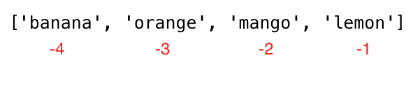

# Introduction

```
print("Hello world")
```

```
print(2 + 3)   # addition(+)
print(3 - 1)   # subtraction(-)
print(2 * 3)   # multiplication(*)
print(3 + 2)   # addition(+)
print(3 - 2)   # subtraction(-)
print(3 * 2)   # multiplication(*)
print(3 / 2)   # division(/)
print(3 ** 2)  # exponential(**)
print(3 % 2)   # modulus(%)
print(3 // 2)  # Floor division operator(//)
```

```
print(type(10))                  # Int
print(type(3.14))                # Float
print(type(1 + 3j))              # Complex
print(type('Asabeneh'))          # String
print(type([1, 2, 3]))           # List
print(type({'name': 'Asabeneh'}))  # Dictionary
print(type({9.8, 3.14, 2.7}))    # Set
print(type((1,2,3)))             #tuple
```


> [!NOTE] 
> Python build-in functions will be done after the functions.


---
## Variables
Variables store data in a computer memory. Mnemonic variables are recommended to use in many programming languages. A mnemonic variable is a variable name that can be easily remembered and associated. A variable refers to a memory address in which data is stored. Number at the beginning, special character, hyphen are not allowed when naming a variable. A variable can have a short name (like x, y, z), but a more descriptive name (firstname, lastname, age, country) is highly recommended.

Python Variable Name Rules

- A variable name must start with a letter or the underscore character
- A variable name cannot start with a number
- A variable name can only contain alpha-numeric characters and underscores (A-z, 0-9, and _ )
- Variable names are case-sensitive (firstname, Firstname, FirstName and FIRSTNAME) are different variables)
-> If you want to use reserved keywords as the variable then use a underscore before them. Eg- "_if"

Example List of Valid variables
```
firstname
lastname
age
country
city
first_name
last_name
capital_city
_if # if we want to use reserved word as a variable
year_2021
year2021
current_year_2021
birth_year
num1
num2
```

Example list of invalid variables
```
first-name
first@name
first$name
num-1
1num
```


### Declaring Multiple Variable in a Line

Multiple variables can also be declared in one line:
```
first_name, last_name, country, age, is_married = 'Asabeneh', 'Yetayeh', 'Helsink', 250, True

print(first_name, last_name, country, age, is_married)
print('First name:', first_name)
print('Last name: ', last_name)
print('Country: ', country)
print('Age: ', age)
print('Married: ', is_married)
```


---
## Data Types
There are several data types in Python. To identify the data type we use the _type_ built-in function.
```
# Different python data types
# Let's declare variables with various data types

first_name = 'Asabeneh'     # str
last_name = 'Yetayeh'       # str
country = 'Finland'         # str
city= 'Helsinki'            # str
age = 250                   # int, it is not my real age, don't worry about it

# Printing out types
print(type('Asabeneh'))          # str
print(type(first_name))          # str
print(type(10))                  # int
print(type(3.14))                # float
print(type(1 + 1j))              # complex
print(type(True))                # bool
print(type([1, 2, 3, 4]))        # list
print(type({'name':'Asabeneh'})) # dict
print(type((1,2)))               # tuple
print(type(zip([1,2],[3,4])))    # zip
print(type({1,2,3}))             # set
```

- zip - In Python, there is no native "zip data type." Instead, zip is a built-in constructor function that returns a specialized iterator called a zip object. This zip object maps corresponding elements from multiple iterables (like lists, tuples, or strings) into an iterator of grouped tuples.
```
>>> names = ["sid","panth","ani"]
>>> age = ["22","17","21"]
>>> zipped_data = zip(names,age)
>>> print(zipped_data)
<zip object at 0x7f730c059cc0>
>>> print(list(zipped_data))
[('sid', '22'), ('panth', '17'), ('ani', '21')]
>>> 
```


---
## Numbers in python
Number data types in Python:

1. Integers: Integer(negative, zero and positive) numbers Example: ... -3, -2, -1, 0, 1, 2, 3 ...
    
2. Floating Point Numbers(Decimal numbers) Example: ... -3.5, -2.25, -1.0, 0.0, 1.1, 2.2, 3.5 ...
    
3. Complex Numbers Example: 1 + j, 2 + 4j, 1 - 1j

---
## Operators
A boolean data type represents one of the two values: _True_ or _False_.
```
>>> if(2==1):
...   print(True)
... else:
...   print(False)
... 
False
>>> 
```

1. Assignment Operators


2. Arithmetic Operators
- Addition(+): a + b
- Subtraction(-): a - b
- Multiplication(*): a * b
- Division(/): a / b
- Modulus(%): a % b
- Floor division(//): a // b
- Exponentiation(**): a ** b

3. Comparison Operators


4. Logical Operators


---
## Strings
Text is a string data type. Any data type written as text is a string. Any data under single, double or triple quote are strings. There are different string methods and built-in functions to deal with string data types. To check the length of a string use the len() method.

- Creating a string
```
letter = 'P'                # A string could be a single character or a bunch of texts
print(letter)               # P
print(len(letter))          # 1
greeting = 'Hello, World!'  # String could be made using a single or double quote,"Hello, World!"
print(greeting)             # Hello, World!
print(len(greeting))        # 13
sentence = "I hope you are enjoying 30 days of Python Challenge"
print(sentence)

multiline_string = '''I am a teacher and enjoy teaching.
I didn't find anything as rewarding as empowering people.
That is why I created 30 days of python.'''
print(multiline_string)

# Another way of doing the same thing
multiline_string = """I am a teacher and enjoy teaching.
I didn't find anything as rewarding as empowering people.
That is why I created 30 days of python."""
print(multiline_string)
```

- String Concatenation
```
first_name = 'Amitabh'
last_name = 'Bacchan'
space = ' '
full_name = first_name  +  space + last_name
print(full_name) # Amitabh Bacchan
# Checking the length of a string using len() built-in function
print(len(first_name))  # 8
print(len(last_name))   # 7
print(len(first_name) > len(last_name)) # True
print(len(full_name)) # 16
```

- Escape Sequences in Strings
In Python and other programming languages \ followed by a character is an escape sequence. Let us see the most common escape characters:

- \n: new line
- \t: Tab means(8 spaces)
- \\: Back slash
- \\': Single quote (')
- \\": Double quote (")

- String Formatting
1. Old Style String Formatting (% Operator)
  %s - String (or any object with a string representation, like numbers)
  %d - Integers
  %f - Floating point numbers
  "%.number of digitsf" - Floating point numbers with fixed precision.
```
# Strings only
first_name = 'Asabeneh'
last_name = 'Yetayeh'
language = 'Python'
formated_string = 'I am %s %s. I teach %s' %(first_name, last_name, language)
print(formated_string)

# Strings  and numbers
radius = 10
pi = 3.14
area = pi * radius ** 2
formated_string = 'The area of circle with a radius %d is %.2f.' %(radius, area) # 2 refers the 2 significant digits after the point

python_libraries = ['Django', 'Flask', 'NumPy', 'Matplotlib','Pandas']
formated_string = 'The following are python libraries:%s' % (python_libraries)
print(formated_string) # "The following are python libraries:['Django', 'Flask', 'NumPy', 'Matplotlib','Pandas']"
```

2. New Style String Formatting (str.format)
    This format was introduced in Python version 3.
```  
first_name = 'Asabeneh'
last_name = 'Yetayeh'
language = 'Python'
formated_string = 'I am {} {}. I teach {}'.format(first_name, last_name, language)
print(formated_string)
a = 4
b = 3

print('{} + {} = {}'.format(a, b, a + b))
print('{} - {} = {}'.format(a, b, a - b))
print('{} * {} = {}'.format(a, b, a * b))
print('{} / {} = {:.2f}'.format(a, b, a / b)) # limits it to two digits after decimal
print('{} % {} = {}'.format(a, b, a % b))
print('{} // {} = {}'.format(a, b, a // b))
print('{} ** {} = {}'.format(a, b, a ** b))

# output
4 + 3 = 7
4 - 3 = 1
4 * 3 = 12
4 / 3 = 1.33
4 % 3 = 1
4 // 3 = 1
4 ** 3 = 64

# Strings  and numbers
radius = 10
pi = 3.14
area = pi * radius ** 2
formated_string = 'The area of a circle with a radius {} is {:.2f}.'.format(radius, area) # 2 digits after decimal
print(formated_string)
```

3. String Interpolation / f-Strings (Python 3.6+)
   Another new string formatting is string interpolation, f-strings. Strings start with f and we can inject the data in their corresponding positions.
```
a = 4
b = 3
print(f'{a} + {b} = {a +b}')
print(f'{a} - {b} = {a - b}')
print(f'{a} * {b} = {a * b}')
print(f'{a} / {b} = {a / b:.2f}')
print(f'{a} % {b} = {a % b}')
print(f'{a} // {b} = {a // b}')
print(f'{a} ** {b} = {a ** b}')
```

### Python Strings as Sequences of Characters

Python strings are sequences of characters, and share their basic methods of access with other Python ordered sequences of objects – lists and tuples. The simplest way of extracting single characters from strings (and individual members from any sequence) is to unpack them into corresponding variables.
```
language = 'Python'
a,b,c,d,e,f = language # unpacking sequence characters into variables
print(a) # P
print(b) # y
print(c) # t
print(d) # h
print(e) # o
print(f) # n
```


```
language = 'Python'
first_letter = language[0]
print(first_letter) # P
second_letter = language[1]
print(second_letter) # y
last_index = len(language) - 1
last_letter = language[last_index]
print(last_letter) # n
language = 'Python'
last_letter = language[-1]
print(last_letter) # n
second_last = language[-2]
print(second_last) # o
```

- Slicing Python Strings
```
language = 'Python'
first_three = language[0:3] # starts at zero index and up to 3 but not include 3
print(first_three) #Pyt
last_three = language[3:6]
print(last_three) # hon
# Another way
last_three = language[-3:]
print(last_three)   # hon
last_three = language[3:]
print(last_three)   # hon
```

- Reversing a string
```
greeting = 'Hello, World!'
print(greeting[::-1]) # !dlroW ,olleH
```

- Skipping Characters While Slicing
```
language = 'Python'
pto = language[0:6:2] #[starting index,ending index,steps]
print(pto) # Pto
```

### String Methods
- capitalize(): Converts the first character of the string to capital letter.
```
challenge = 'python is a mastikhor language'
print(challenge.capitalize()) # 'Python is a mastikhor language'
```

- count(): returns occurrences of substring in string, count(substring, start=.., end=..). The start is a starting indexing for counting and end is the last index to count.
```
challenge = 'thirty days of python'
print(challenge.count('y')) # 3
print(challenge.count('y', 7, 14)) # 1, 
print(challenge.count('th')) # 2
```

- endswith(): Checks if a string ends with a specified ending.
```
challenge = 'thirty days of python'
print(challenge.endswith('on'))   # True
print(challenge.endswith('tion')) # False
```

- expandtabs(): Replaces tab character with spaces, default tab size is 8. It takes tab size argument.
```
challenge = 'thirty\tdays\tof\tpython'
print(challenge.expandtabs())   # 'thirty  days    of      python'
print(challenge.expandtabs(10)) # 'thirty    days      of        python'
```

- find(): Returns the index of the first occurrence of a substring, if not found returns -1.
```
challenge = 'thirty days of python'
print(challenge.find('y'))  # 5
print(challenge.find('th')) # 0
```

- rfind(): Returns the index of the last occurrence of a substring, if not found returns -1.
```
challenge = 'thirty days of python'
print(challenge.rfind('y'))  # 16
print(challenge.rfind('th')) # 17
```

- index(): Returns the lowest index of a substring, additional arguments indicate starting and ending index (default 0 and string length - 1). If the substring is not found it raises a valueError.
```
challenge = 'thirty days of python'
sub_string = 'da'
print(challenge.index(sub_string))  # 7
print(challenge.index(sub_string, 9)) # error
```

- rindex(): Returns the highest index of a substring, additional arguments indicate starting and ending index (default 0 and string length - 1)
```
challenge = 'thirty days of python'
sub_string = 'da'
print(challenge.rindex(sub_string))  # 7
print(challenge.rindex(sub_string, 9)) # error
print(challenge.rindex('on', 8)) # 19
```

- isalnum(): Checks alphanumeric character
```py
challenge = 'ThirtyDaysPython'
print(challenge.isalnum()) # True

challenge = '30DaysPython'
print(challenge.isalnum()) # True

challenge = 'thirty days of python'
print(challenge.isalnum()) # False, space is not an alphanumeric character

challenge = 'thirty days of python 2019'
print(challenge.isalnum()) # False
```

- isalpha(): Checks if all string elements are alphabet characters (a-z and A-Z)
```py
challenge = 'thirty days of python'
print(challenge.isalpha()) # False, space is once again excluded
challenge = 'ThirtyDaysPython'
print(challenge.isalpha()) # True
num = '123'
print(num.isalpha())      # False
```

- isdecimal(): Checks if all characters in a string are decimal (0-9)
```py
challenge = 'thirty days of python'
print(challenge.isdecimal())  # False
challenge = '123'
print(challenge.isdecimal())  # True
challenge = '\u00B2'
print(challenge.isdigit())   # True 
challenge = '12 3'
print(challenge.isdecimal())  # False, space not allowed
```

- isdigit(): Checks if all characters in a string are numbers (0-9 and some other unicode characters for numbers)
```py
challenge = 'Thirty'
print(challenge.isdigit()) # False
challenge = '30'
print(challenge.isdigit())   # True
challenge = '\u00B2'
print(challenge.isdigit())   # True
```

- isnumeric(): Checks if all characters in a string are numbers or number related (just like isdigit(), just accepts more symbols, like ½)
```py
num = '10'
print(num.isnumeric()) # True
num = '\u00BD' # ½
print(num.isnumeric()) # True
num = '10.5'
print(num.isnumeric()) # False
```

- isidentifier(): Checks for a valid identifier - it checks if a string is a valid variable name
```py
challenge = '30DaysOfPython'
print(challenge.isidentifier()) # False, because it starts with a number
challenge = 'thirty_days_of_python'
print(challenge.isidentifier()) # True
```

- islower(): Checks if all alphabet characters in the string are lowercase
```py
challenge = 'thirty days of python'
print(challenge.islower()) # True
challenge = 'Thirty days of python'
print(challenge.islower()) # False
```

- isupper(): Checks if all alphabet characters in the string are uppercase
```py
challenge = 'thirty days of python'
print(challenge.isupper()) #  False
challenge = 'THIRTY DAYS OF PYTHON'
print(challenge.isupper()) # True
```

- join(): Returns a concatenated string
```py
web_tech = ['HTML', 'CSS', 'JavaScript', 'React']
result = ' '.join(web_tech)
print(result) # 'HTML CSS JavaScript React'
```

```py
web_tech = ['HTML', 'CSS', 'JavaScript', 'React']
result = '# '.join(web_tech)
print(result) # 'HTML# CSS# JavaScript# React'
```

- strip(): Removes all given characters starting from the beginning and end of the string
```py
challenge = 'thirty days of pythoonnn'
print(challenge.strip('noth')) # 'irty days of py'
```

- replace(): Replaces substring with a given string
```py
challenge = 'thirty days of python'
print(challenge.replace('python', 'coding')) # 'thirty days of coding'
```

- split(): Splits the string, using given string or space as a separator
```py
challenge = 'thirty days of python'
print(challenge.split()) # ['thirty', 'days', 'of', 'python']
challenge = 'thirty, days, of, python'
print(challenge.split(', ')) # ['thirty', 'days', 'of', 'python']
```

- title(): Returns a title cased string
```py
challenge = 'thirty days of python'
print(challenge.title()) # Thirty Days Of Python
```

- swapcase(): Converts all uppercase characters to lowercase and all lowercase characters to uppercase characters
```py
challenge = 'thirty days of python'
print(challenge.swapcase())   # THIRTY DAYS OF PYTHON
challenge = 'Thirty Days Of Python'
print(challenge.swapcase())  # tHIRTY dAYS oF pYTHON
```

- startswith(): Checks if String Starts with the Specified String
```py
challenge = 'thirty days of python'
print(challenge.startswith('thirty')) # True

challenge = '30 days of python'
print(challenge.startswith('thirty')) # False
```


---
## Lists
List: is a collection which is ordered and changeable(modifiable). Allows duplicate members.
A list is collection of different data types which is ordered and modifiable(mutable). A list can be empty or it may have different data type items.
- Creating a list
  - A list can be created in two manners
   -> Using the build-in function list()
   -> Using the `[]` square brackets
```
# syntax
lst = list()

empty_list = list() # this is an empty list, no item in the list
print(len(empty_list)) # 0

# syntax
lst = []

empty_list = [] # this is an empty list, no item in the list
print(len(empty_list)) # 0
```

```
fruits = ['banana', 'orange', 'mango', 'lemon']                     # list of fruits
vegetables = ['Tomato', 'Potato', 'Cabbage','Onion', 'Carrot']      # list of vegetables
animal_products = ['milk', 'meat', 'butter', 'yoghurt']             # list of animal products
web_techs = ['HTML', 'CSS', 'JS', 'React','Redux', 'Node', 'MongDB'] # list of web technologies
countries = ['Finland', 'Estonia', 'Denmark', 'Sweden', 'Norway'] 

# Print the lists and its length
print('Fruits:', fruits)
print('Number of fruits:', len(fruits))
print('Vegetables:', vegetables)
print('Number of vegetables:', len(vegetables))
print('Animal products:',animal_products)
print('Number of animal products:', len(animal_products))
print('Web technologies:', web_techs)
print('Number of web technologies:', len(web_techs))
print('Countries:', countries)
print('Number of countries:', len(countries))
```

Outputs:
```
output
Fruits: ['banana', 'orange', 'mango', 'lemon']
Number of fruits: 4
Vegetables: ['Tomato', 'Potato', 'Cabbage', 'Onion', 'Carrot']
Number of vegetables: 5
Animal products: ['milk', 'meat', 'butter', 'yoghurt']
Number of animal products: 4
Web technologies: ['HTML', 'CSS', 'JS', 'React', 'Redux', 'Node', 'MongDB']
Number of web technologies: 7
Countries: ['Finland', 'Estonia', 'Denmark', 'Sweden', 'Norway']
Number of countries: 5
```

- A list can have more than one datatype
```
 lst = ['Asabeneh', 250, True, {'country':'Finland', 'city':'Helsinki'}] # list containing different data types
```

- Indexing in list




- Unpacking list items
```
lst = ['item1','item2','item3', 'item4', 'item5']
first_item, second_item, third_item, *rest = lst
print(first_item)     # item1
print(second_item)    # item2
print(third_item)     # item3
print(rest)           # ['item4', 'item5']

# First Example
fruits = ['banana', 'orange', 'mango', 'lemon','lime','apple']
first_fruit, second_fruit, third_fruit, *rest = fruits 
print(first_fruit)     # banana
print(second_fruit)    # orange
print(third_fruit)     # mango
print(rest)           # ['lemon','lime','apple']
# Second Example about unpacking list
first, second, third,*rest, tenth = [1,2,3,4,5,6,7,8,9,10]
print(first)          # 1
print(second)         # 2
print(third)          # 3
print(rest)           # [4,5,6,7,8,9]
print(tenth)          # 10
# Third Example about unpacking list
countries = ['Germany', 'France','Belgium','Sweden','Denmark','Finland','Norway','Iceland','Estonia']
gr, fr, bg, sw, *scandic, es = countries
print(gr) 
print(fr)
print(bg)
print(sw)
print(scandic)
print(es)
```

- Slicing Items from a List
  Positive Indexing: We can specify a range of positive indexes by specifying the start, end and step, the return value will be a new list. (default values for start = 0, end = len(lst) - 1 (last item), step = 1)
```py
fruits = ['banana', 'orange', 'mango', 'lemon']
all_fruits = fruits[0:4] # it returns all the fruits
# this will also give the same result as the one above
all_fruits = fruits[0:] # if we don't set where to stop it takes all the rest
orange_and_mango = fruits[1:3] # it does not include the first index
orange_mango_lemon = fruits[1:]
orange_and_lemon = fruits[::2] # here we used a 3rd argument, step. It will take every 2cnd item - ['banana', 'mango']
```

   Negative Indexing: We can specify a range of negative indexes by specifying the start, end and step, the return value will be a new list.
```py
fruits = ['banana', 'orange', 'mango', 'lemon']
all_fruits = fruits[-4:] # it returns all the fruits
orange_and_mango = fruits[-3:-1] # it does not include the last index,['orange', 'mango']
orange_mango_lemon = fruits[-3:] # this will give starting from -3 to the end,['orange', 'mango', 'lemon']
reverse_fruits = fruits[::-1] # a negative step will take the list in reverse order,['lemon', 'mango', 'orange', 'banana']
```

- Modifying Lists
  List is a mutable or modifiable ordered collection of items. Lets modify the fruit list.
```py
fruits = ['banana', 'orange', 'mango', 'lemon']
fruits[0] = 'avocado'
print(fruits)       #  ['avocado', 'orange', 'mango', 'lemon']
fruits[1] = 'apple'
print(fruits)       #  ['avocado', 'apple', 'mango', 'lemon']
last_index = len(fruits) - 1
fruits[last_index] = 'lime'
print(fruits)        #  ['avocado', 'apple', 'mango', 'lime']
```

- Checking Items in a List
  Checking an item if it is a member of a list using *in* operator. See the example below.
```py
fruits = ['banana', 'orange', 'mango', 'lemon']
does_exist = 'banana' in fruits
print(does_exist)  # True
does_exist = 'lime' in fruits
print(does_exist)  # False
```

 - Adding Items to a List
   To add item to the end of an existing list we use the method *append()*.
```py
# syntax
lst = list()
lst.append(item)
```

```py
fruits = ['banana', 'orange', 'mango', 'lemon']
fruits.append('apple')
print(fruits)           # ['banana', 'orange', 'mango', 'lemon', 'apple']
fruits.append('lime')   # ['banana', 'orange', 'mango', 'lemon', 'apple', 'lime']
print(fruits)
```

-  Inserting Items into a List
   We can use *insert()* method to insert a single item at a specified index in a list. Note that other items are shifted to the right. The *insert()* methods takes two arguments:index and an item to insert.

```py
# syntax
lst = ['item1', 'item2']
lst.insert(index, item)
```

```py
fruits = ['banana', 'orange', 'mango', 'lemon']
fruits.insert(2, 'apple') # insert apple between orange and mango
print(fruits)           # ['banana', 'orange', 'apple', 'mango', 'lemon']
fruits.insert(3, 'lime')   # ['banana', 'orange', 'apple', 'lime', 'mango', 'lemon']
print(fruits)
```

- Removing Items from a List
  The remove method removes a specified item from a list
```py
# syntax
lst = ['item1', 'item2']
lst.remove(item)
```

```py
fruits = ['banana', 'orange', 'mango', 'lemon', 'banana']
fruits.remove('banana')
print(fruits)  # ['orange', 'mango', 'lemon', 'banana'] - this method removes the first occurrence of the item in the list
fruits.remove('lemon')
print(fruits)  # ['orange', 'mango', 'banana']
```

-  Removing Items Using Pop
   The *pop()* method removes the specified index, (or the last item if index is not specified):
```py
# syntax
lst = ['item1', 'item2']
lst.pop()       # last item
lst.pop(index)
```

```py
fruits = ['banana', 'orange', 'mango', 'lemon']
fruits.pop()
print(fruits)       # ['banana', 'orange', 'mango']

fruits.pop(0)
print(fruits)       # ['orange', 'mango']
```

- Removing Items Using Del
  The *del* keyword removes the specified index and it can also be used to delete items within index range. It can also delete the list completely
```py
# syntax
lst = ['item1', 'item2']
del lst[index] # only a single item
del lst        # to delete the list completely
```
```py
fruits = ['banana', 'orange', 'mango', 'lemon', 'kiwi', 'lime']
del fruits[0]
print(fruits)       # ['orange', 'mango', 'lemon', 'kiwi', 'lime']
del fruits[1]
print(fruits)       # ['orange', 'lemon', 'kiwi', 'lime']
del fruits[1:3]     # this deletes items between given indexes, so it does not delete the item with index 3!
print(fruits)       # ['orange', 'lime']
del fruits
print(fruits)       # This should give: NameError: name 'fruits' is not defined
```

- Clearing List Items
  The *clear()* method empties the list:
```py
# syntax
lst = ['item1', 'item2']
lst.clear()
```

```py
fruits = ['banana', 'orange', 'mango', 'lemon']
fruits.clear()
print(fruits)       # []
```

-  Copying a List
   It is possible to copy a list by reassigning it to a new variable in the following way: list2 = list1. Now, list2 is a reference of list1, any changes we make in list2 will also modify the original, list1. But there are lots of case in which we do not like to modify the original instead we like to have a different copy. One of way of avoiding the problem above is using _copy()_.
```py
# syntax
lst = ['item1', 'item2']
lst_copy = lst.copy()
```

```py
fruits = ['banana', 'orange', 'mango', 'lemon']
fruits_copy = fruits.copy()
print(fruits_copy)       # ['banana', 'orange', 'mango', 'lemon']
```

- Joining Lists
  There are several ways to join, or concatenate, two or more lists in Python.
-> Plus Operator (+)
```py
# syntax
list3 = list1 + list2
```

```py
positive_numbers = [1, 2, 3, 4, 5]
zero = [0]
negative_numbers = [-5,-4,-3,-2,-1]
integers = negative_numbers + zero + positive_numbers
print(integers) # [-5, -4, -3, -2, -1, 0, 1, 2, 3, 4, 5]
fruits = ['banana', 'orange', 'mango', 'lemon']
vegetables = ['Tomato', 'Potato', 'Cabbage', 'Onion', 'Carrot']
fruits_and_vegetables = fruits + vegetables
print(fruits_and_vegetables ) # ['banana', 'orange', 'mango', 'lemon', 'Tomato', 'Potato', 'Cabbage', 'Onion', 'Carrot']
```

-> Joining using extend() method
  The *extend()* method allows to append list in a list. See the example below.
```py
# syntax
list1 = ['item1', 'item2']
list2 = ['item3', 'item4', 'item5']
list1.extend(list2) # ['item1', 'item2', 'item3', 'item4', 'item5']
```

```py
num1 = [0, 1, 2, 3]
num2= [4, 5, 6]
num1.extend(num2)
print('Numbers:', num1) # Numbers: [0, 1, 2, 3, 4, 5, 6]
negative_numbers = [-5,-4,-3,-2,-1]
positive_numbers = [1, 2, 3,4,5]
zero = [0]
negative_numbers.extend(zero)
negative_numbers.extend(positive_numbers)
print('Integers:', negative_numbers) # Integers: [-5, -4, -3, -2, -1, 0, 1, 2, 3, 4, 5]
fruits = ['banana', 'orange', 'mango', 'lemon']
vegetables = ['Tomato', 'Potato', 'Cabbage', 'Onion', 'Carrot']
fruits.extend(vegetables)
print('Fruits and vegetables:', fruits ) # Fruits and vegetables: ['banana', 'orange', 'mango', 'lemon', 'Tomato', 'Potato', 'Cabbage', 'Onion', 'Carrot']
```

- Counting Items in a List
  The *count()* method returns the number of times an item appears in a list:
```py
# syntax
lst = ['item1', 'item2']
lst.count(item)
```

```py
fruits = ['banana', 'orange', 'mango', 'lemon']
print(fruits.count('orange'))   # 1
ages = [22, 19, 24, 25, 26, 24, 25, 24]
print(ages.count(24))           # 3
```

-  Finding Index of an Item
   The *index()* method returns the index of an item in the list:
```py
# syntax
lst = ['item1', 'item2']
lst.index(item)
```

```py
fruits = ['banana', 'orange', 'mango', 'lemon']
print(fruits.index('orange'))   # 1
ages = [22, 19, 24, 25, 26, 24, 25, 24]
print(ages.index(24))           # 2, the first occurrence
```

- Reversing a List
  The *reverse()* method reverses the order of a list.
```py
# syntax
lst = ['item1', 'item2']
lst.reverse()
```

```py
fruits = ['banana', 'orange', 'mango', 'lemon']
fruits.reverse()
print(fruits) # ['lemon', 'mango', 'orange', 'banana']
ages = [22, 19, 24, 25, 26, 24, 25, 24]
ages.reverse()
print(ages) # [24, 25, 24, 26, 25, 24, 19, 22]
```

- Sorting List Items
  To sort lists we can use _sort()_ method or _sorted()_ built-in functions. The _sort()_ method reorders the list items in ascending order and modifies the original list. If an argument of _sort()_ method reverse is equal to true, it will arrange the list in descending order.
-> sort(): this method modifies the original list
  ```py
  # syntax
  lst = ['item1', 'item2']
  lst.sort()                # ascending
  lst.sort(reverse=True)    # descending
  ```
  **Example:**
  ```py
  fruits = ['banana', 'orange', 'mango', 'lemon']
  fruits.sort()
  print(fruits)             # sorted in alphabetical order, ['banana', 'lemon', 'mango', 'orange']
  fruits.sort(reverse=True)
  print(fruits) # ['orange', 'mango', 'lemon', 'banana']
  ages = [22, 19, 24, 25, 26, 24, 25, 24]
  ages.sort()
  print(ages) #  [19, 22, 24, 24, 24, 25, 25, 26]
 
  ages.sort(reverse=True)
  print(ages) #  [26, 25, 25, 24, 24, 24, 22, 19]
  ```
  sorted(): returns the ordered list without modifying the original list
  **Example:**
  ```py
  fruits = ['banana', 'orange', 'mango', 'lemon']
  print(sorted(fruits))   # ['banana', 'lemon', 'mango', 'orange']
  # Reverse order
  fruits = ['banana', 'orange', 'mango', 'lemon']
  fruits = sorted(fruits,reverse=True)
  print(fruits)     # ['orange', 'mango', 'lemon', 'banana']
  ```

---
## Tuples

A tuple is a collection of different data types which is ordered and unchangeable (immutable). Tuples are written with round brackets, (). Once a tuple is created, we cannot change its values. We cannot use add, insert, remove methods in a tuple because it is not modifiable (mutable). Unlike list, tuple has few methods. Methods related to tuples:

- tuple(): to create an empty tuple
- count(): to count the number of a specified item in a tuple
- index(): to find the index of a specified item in a tuple
- `+` operator: to join two or more tuples and to create a new tuple

#### Creating a Tuple
- Empty tuple: Creating an empty tuple
  
  ```py
  # syntax
  empty_tuple = ()
  # or using the tuple constructor
  empty_tuple = tuple()
  ```

- Tuple with initial values
  
  ```py
  # syntax
  tpl = ('item1', 'item2','item3')
  ```

  ```py
  fruits = ('banana', 'orange', 'mango', 'lemon')
  ```

#### Tuple length
We use the _len()_ method to get the length of a tuple.

```py
# syntax
tpl = ('item1', 'item2', 'item3')
len(tpl)
```

#### Accessing Tuple Items
- Positive Indexing
  Similar to the list data type we use positive or negative indexing to access tuple items.

  ```py
  # Syntax
  tpl = ('item1', 'item2', 'item3')
  first_item = tpl[0]
  second_item = tpl[1]
  ```

  ```py
  fruits = ('banana', 'orange', 'mango', 'lemon')
  first_fruit = fruits[0]
  second_fruit = fruits[1]
  last_index =len(fruits) - 1
  last_fruit = fruits[last_index]
  ```

- Negative indexing
  Negative indexing means beginning from the end, -1 refers to the last item, -2 refers to the second last and the negative of the list/tuple length refers to the first item.

  ```py
  # Syntax
  tpl = ('item1', 'item2', 'item3','item4')
  first_item = tpl[-4]
  second_item = tpl[-3]
  ```

  ```py
  fruits = ('banana', 'orange', 'mango', 'lemon')
  first_fruit = fruits[-4]
  second_fruit = fruits[-3]
  last_fruit = fruits[-1]
  ```

#### Slicing tuples
We can slice out a sub-tuple by specifying a range of indexes where to start and where to end in the tuple, the return value will be a new tuple with the specified items.

- Range of Positive Indexes

  ```py
  # Syntax
  tpl = ('item1', 'item2', 'item3','item4')
  all_items = tpl[0:4]         # all items
  all_items = tpl[0:]         # all items
  middle_two_items = tpl[1:3]  # does not include item at index 3
  ```

  ```py
  fruits = ('banana', 'orange', 'mango', 'lemon')
  all_fruits = fruits[0:4]    # all items
  all_fruits= fruits[0:]      # all items
  orange_mango = fruits[1:3]  # doesn't include item at index 3
  orange_to_the_rest = fruits[1:]
  ```

- Range of Negative Indexes

  ```py
  # Syntax
  tpl = ('item1', 'item2', 'item3','item4')
  all_items = tpl[-4:]         # all items
  middle_two_items = tpl[-3:-1]  # does not include item at index 3 (-1)
  ```

  ```py
  fruits = ('banana', 'orange', 'mango', 'lemon')
  all_fruits = fruits[-4:]    # all items
  orange_mango = fruits[-3:-1]  # doesn't include item at index 3
  orange_to_the_rest = fruits[-3:]
  ```

#### Changing Tuples to Lists
We can change tuples to lists and lists to tuples. Tuple is immutable if we want to modify a tuple we should change it to a list.

```py
# Syntax
tpl = ('item1', 'item2', 'item3','item4')
lst = list(tpl)
```

```py
fruits = ('banana', 'orange', 'mango', 'lemon')
fruits = list(fruits)
fruits[0] = 'apple'
print(fruits)     # ['apple', 'orange', 'mango', 'lemon']
fruits = tuple(fruits)
print(fruits)     # ('apple', 'orange', 'mango', 'lemon')
```

#### Checking an Item in a Tuple
We can check if an item exists or not in a tuple using _in_, it returns a boolean.

```py
# Syntax
tpl = ('item1', 'item2', 'item3','item4')
'item2' in tpl # True
```

```py
fruits = ('banana', 'orange', 'mango', 'lemon')
print('orange' in fruits) # True
print('apple' in fruits) # False
fruits[0] = 'apple' # TypeError: 'tuple' object does not support item assignment
```

#### Joining Tuples
We can join two or more tuples using + operator

```py
# syntax
tpl1 = ('item1', 'item2', 'item3')
tpl2 = ('item4', 'item5','item6')
tpl3 = tpl1 + tpl2
```

```py
fruits = ('banana', 'orange', 'mango', 'lemon')
vegetables = ('Tomato', 'Potato', 'Cabbage','Onion', 'Carrot')
fruits_and_vegetables = fruits + vegetables
```

#### Deleting Tuples
It is not possible to remove a single item in a tuple but it is possible to delete the tuple itself using _del_.

```py
# syntax
tpl1 = ('item1', 'item2', 'item3')
del tpl1

```

```py
fruits = ('banana', 'orange', 'mango', 'lemon')
del fruits
```

---
## Sets
Set is a collection of items. Let me take you back to your elementary or high school Mathematics lesson. The Mathematics definition of a set can be applied also in Python. Set is a collection of unordered and un-indexed distinct elements. In Python set is used to store unique items, and it is possible to find the _union_, _intersection_, _difference_, _symmetric difference_, _subset_, _super set_ and _disjoint set_ among sets.

#### Creating a Set
To create an empty set, we use the set() function. Empty curly brackets {} will create a dictionary. 

- Creating an empty set
```py
# syntax
st = set()
```
- Creating a set with initial items
```py
# syntax
st = {'item1', 'item2', 'item3', 'item4'}
```
**Example:**
```py
# syntax
fruits = {'banana', 'orange', 'mango', 'lemon'}
```

#### Getting Set's Length
We use **len()** method to find the length of a set.
```py
# syntax
st = {'item1', 'item2', 'item3', 'item4'}
len(st)
```
**Example:**
```py
fruits = {'banana', 'orange', 'mango', 'lemon'}
len(fruits)
```

#### Accessing Items in a Set
We use loops to access items. We will see this in loop section
#### Checking an Item
To check if an item exist in a list we use _in_ membership operator.
```py
# syntax
st = {'item1', 'item2', 'item3', 'item4'}
print("Does set st contain item3? ", 'item3' in st) # Does set st contain item3? True
```
**Example:**
```py
fruits = {'banana', 'orange', 'mango', 'lemon'}
print('mango' in fruits ) # True
```

#### Adding Items to a Set
Once a set is created we cannot change any items and we can also add additional items.
- Add one item using _add()_
```py
# syntax
st = {'item1', 'item2', 'item3', 'item4'}
st.add('item5')
```
**Example:**
```py
fruits = {'banana', 'orange', 'mango', 'lemon'}
fruits.add('lime')
```
- Add multiple items using _update()_
  The _update()_ allows to add multiple items to a set. The _update()_ takes a list argument.
```py
# syntax
st = {'item1', 'item2', 'item3', 'item4'}
st.update(['item5','item6','item7'])
```
**Example:**
```py
fruits = {'banana', 'orange', 'mango', 'lemon'}
vegetables = ('tomato', 'potato', 'cabbage','onion', 'carrot')
fruits.update(vegetables)
```

#### Removing Items from a Set
We can remove an item from a set using _remove()_ method. If the item is not found _remove()_ method will raise errors, so it is good to check if the item exist in the given set. However, _discard()_ method doesn't raise any errors.
```py
# syntax
st = {'item1', 'item2', 'item3', 'item4'}
st.remove('item2')
```
The pop() methods remove a random item from a list and it returns the removed item.
**Example:**
```py
fruits = {'banana', 'orange', 'mango', 'lemon'}
fruits.pop()  # removes a random item from the set

```
If we are interested in the removed item.
```py
fruits = {'banana', 'orange', 'mango', 'lemon'}
removed_item = fruits.pop() 
```

#### Clearing Items in a Set
If we want to clear or empty the set we use _clear_ method.
```py
# syntax
st = {'item1', 'item2', 'item3', 'item4'}
st.clear()
```
**Example:**
```py
fruits = {'banana', 'orange', 'mango', 'lemon'}
fruits.clear()
print(fruits) # set()
```

#### Deleting a Set
If we want to delete the set itself we use _del_ operator.
```py
# syntax
st = {'item1', 'item2', 'item3', 'item4'}
del st
```
**Example:**
```py
fruits = {'banana', 'orange', 'mango', 'lemon'}
del fruits
```

#### Converting List to Set
We can convert list to set and set to list. Converting list to set removes duplicates and only unique items will be reserved.
```py
# syntax
lst = ['item1', 'item2', 'item3', 'item4', 'item1']
st = set(lst)  # {'item2', 'item4', 'item1', 'item3'} - the order is random, because sets in general are unordered
```
**Example:**
```py
fruits = ['banana', 'orange', 'mango', 'lemon','orange', 'banana']
fruits = set(fruits) # {'mango', 'lemon', 'banana', 'orange'}
```

#### Joining Sets
We can join two sets using the _union()_ or _update()_ method or _|_ symbol .
- Union
  This method returns a new set
```py
# syntax
st1 = {'item1', 'item2', 'item3', 'item4'}
st2 = {'item5', 'item6', 'item7', 'item8'}
st3 = st1.union(st2) #st3 = st1 | st2
```
**Example:**
```py
fruits = {'banana', 'orange', 'mango', 'lemon'}
vegetables = {'tomato', 'potato', 'cabbage','onion', 'carrot'}
print(fruits.union(vegetables)) # {'lemon', 'carrot', 'tomato', 'banana', 'mango', 'orange', 'cabbage', 'potato', 'onion'}
# or using this : print(fruits | vegetables)
```
- Update
  This method inserts a set into a given set
```py
# syntax
st1 = {'item1', 'item2', 'item3', 'item4'}
st2 = {'item5', 'item6', 'item7', 'item8'}
st1.update(st2) # st2 contents are added to st1
```
**Example:**
```py
fruits = {'banana', 'orange', 'mango', 'lemon'}
vegetables = {'tomato', 'potato', 'cabbage','onion', 'carrot'}
fruits.update(vegetables)
print(fruits) # {'lemon', 'carrot', 'tomato', 'banana', 'mango', 'orange', 'cabbage', 'potato', 'onion'}
```

#### Finding Intersection Items
Intersection returns a set of items which are in both the sets or using _&_ symbol. See the example
```py
# syntax
st1 = {'item1', 'item2', 'item3', 'item4'}
st2 = {'item3', 'item2'}
st1.intersection(st2) # {'item3', 'item2'}
# or using thia : st1 & st2
```
**Example:**
```py
whole_numbers = {0, 1, 2, 3, 4, 5, 6, 7, 8, 9, 10}
even_numbers = {0, 2, 4, 6, 8, 10}
whole_numbers.intersection(even_numbers) # {0, 2, 4, 6, 8, 10}

python = {'p', 'y', 't', 'h', 'o','n'}
dragon = {'d', 'r', 'a', 'g', 'o','n'}
python.intersection(dragon)     # {'o', 'n'}
# python & dragon
```

#### Checking Subset and Super Set
A set can be a subset or super set of other sets:
- Subset: _issubset()_
- Super set: _issuperset_
```py
# syntax
st1 = {'item1', 'item2', 'item3', 'item4'}
st2 = {'item2', 'item3'}
st2.issubset(st1) # True
st1.issuperset(st2) # True
```
**Example:**
```py
whole_numbers = {0, 1, 2, 3, 4, 5, 6, 7, 8, 9, 10}
even_numbers = {0, 2, 4, 6, 8, 10}
whole_numbers.issubset(even_numbers) # False, because it is a super set
whole_numbers.issuperset(even_numbers) # True

python = {'p', 'y', 't', 'h', 'o','n'}
dragon = {'d', 'r', 'a', 'g', 'o','n'}
python.issubset(dragon)     # False
```

#### Checking the Difference Between Two Sets
It returns the difference between two sets or using _-_ symbol .
```py
# syntax
st1 = {'item1', 'item2', 'item3', 'item4'}
st2 = {'item2', 'item3'}
st2.difference(st1) # set() : st2 - st1
st1.difference(st2) # {'item1', 'item4'} => st1\st2  : st2 - st1
```
**Example:**
```py
whole_numbers = {0, 1, 2, 3, 4, 5, 6, 7, 8, 9, 10}
even_numbers = {0, 2, 4, 6, 8, 10}
whole_numbers.difference(even_numbers) # {1, 3, 5, 7, 9}

python = {'p', 'y', 't', 'o','n'}
dragon = {'d', 'r', 'a', 'g', 'o','n'}
python.difference(dragon)     # {'p', 'y', 't'}  - the result is unordered (characteristic of sets)
# python - dragon
dragon.difference(python)     # {'d', 'r', 'a', 'g'}
# dragon - python
```

#### Finding Symmetric Difference Between Two Sets
It returns the symmetric difference between two sets. It means that it returns a set that contains all items from both sets, except items that are present in both sets, mathematically: (A\B) ∪ (B\A)

```py
# syntax
st1 = {'item1', 'item2', 'item3', 'item4'}
st2 = {'item2', 'item3'}
# it means (A\B)∪(B\A)
st2.symmetric_difference(st1) # {'item1', 'item4'} : st2 ^ st1
```
**Example:**
```py
whole_numbers = {0, 1, 2, 3, 4, 5, 6, 7, 8, 9, 10}
some_numbers = {1, 2, 3, 4, 5}
whole_numbers.symmetric_difference(some_numbers) # {0, 6, 7, 8, 9, 10}

python = {'p', 'y', 't', 'h', 'o','n'}
dragon = {'d', 'r', 'a', 'g', 'o','n'}
python.symmetric_difference(dragon)  # {'r', 't', 'p', 'y', 'g', 'a', 'd', 'h'}
# python ^ dragon
```

#### Joining Sets
If two sets do not have a common item or items we call them disjoint sets. We can check if two sets are joint or disjoint using _isdisjoint()_ method.

```py
# syntax
st1 = {'item1', 'item2', 'item3', 'item4'}
st2 = {'item2', 'item3'}
st2.isdisjoint(st1) # False
```

**Example:**

```py
even_numbers = {0, 2, 4 ,6, 8}
odd_numbers = {1, 3, 5, 7, 9}
even_numbers.isdisjoint(odd_numbers) # True, because no common item

python = {'p', 'y', 't', 'h', 'o','n'}
dragon = {'d', 'r', 'a', 'g', 'o','n'}
python.isdisjoint(dragon)  # False, there are common items {'o', 'n'}
```

---
